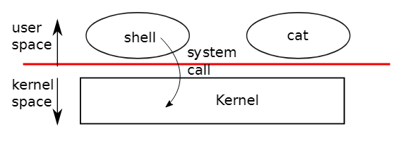
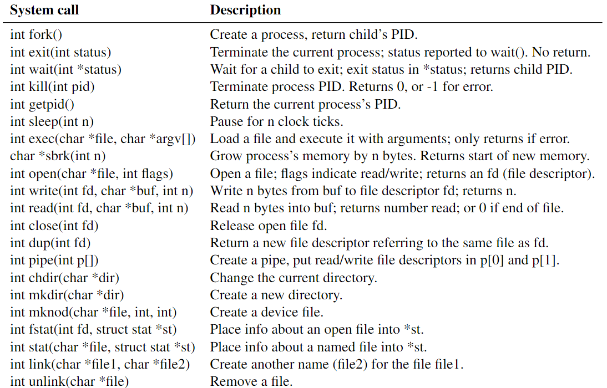

# Chapter 1 操作系统接口（Operating system interfaces）

操作系统的工作是在多个程序之间共享计算机，并提供比硬件本身支持的更有用的服务。操作系统管理和抽象低级硬件，使得例如文字处理器不必关心使用的是哪种类型的磁盘硬件。操作系统在多个程序之间共享硬件资源，使它们能够同时运行（或表现为同时运行）。最后，操作系统提供了受控的程序交互方式，以便它们可以共享数据或共同工作。

操作系统通过接口向用户程序提供服务。设计一个良好的接口实际上是困难的。一方面，我们希望接口简单且窄，因为这样更容易正确实现。另一方面，我们可能会想要向应用程序提供许多复杂的功能。解决这种张力的技巧在于设计依赖于少量机制的接口，这些机制可以组合提供很大的通用性。

本书使用一个操作系统作为具体示例来说明操作系统的概念。该操作系统是 xv6，它提供了肯·汤普森和丹尼斯·里奇的 Unix 操作系统[14]引入的基本接口，并模仿了 Unix 的内部设计。Unix 提供了一个窄接口，其机制很好地组合在一起，提供了令人惊讶的通用性。这种接口非常成功，以至于现代操作系统 —— 如 BSD、Linux、Mac OS X、Solaris，甚至在较小程度上的 Microsoft Windows —— 都具有类似 Unix 的接口。理解 xv6 是理解这些系统和其他许多系统的良好起点。

正如图 1.1 所示，xv6 采用了传统的内核形式，即提供服务给运行中的程序的特殊程序。每个运行的程序，称为一个进程，都有包含指令、数据和栈的内存。指令实现程序的计算。数据是计算所作用的变量。栈组织程序的过程调用。一个给定的计算机通常有许多进程，但只有一个内核。



当进程需要调用内核服务时，它调用一个系统调用，即操作系统接口中的一个调用。系统调用进入内核；内核执行服务并返回。因此，一个进程在用户空间和内核空间之间交替执行。

内核使用 CPU 提供的硬件保护机制，确保每个在用户空间执行的进程只能访问自己的内存。内核以实现这些保护所需的硬件特权级别执行；用户程序在没有这些特权的情况下执行。当用户程序调用系统调用时，硬件会提高特权级别，并开始执行内核中预先安排的函数。

> [!important]
>
> 该文档通常使用 "CPU" 一词来指代执行计算的硬件元素，这是 "中央处理单元" 的缩写。其他文档（例如，RISC-V 规范）也使用 "处理器"、"核心" 和 "hart" 一词来代替 "CPU"。

内核提供的系统调用集合是用户程序看到的接口。xv6 内核提供了传统 Unix 内核通常提供的服务和系统调用的子集。图 1.2 列出了 xv6 的所有系统调用。

本章的其余部分概述了 xv6 的服务 —— 进程、内存、文件描述符、管道和文件系统 —— 并通过代码片段和对 shell 的使用来说明它们，Unix 的命令行用户界面，以及它们的用法。 shell 的使用示例说明了它们是如何被精心设计的。 

shell 是一个普通程序，从用户那里读取命令并执行它们。 shell 是一个用户程序而不是内核的一部分，这表明了系统调用接口的强大之处：shell 并没有什么特别之处。 这也意味着 shell 很容易被替换；因此，现代 Unix 系统有各种各样的 shell 可供选择，每个 shell 都有自己的用户界面和脚本功能。 xv6 shell 是 Unix Bourne shell 本质的简单实现。其实现可以在 (user/sh.c:1) 找到

## 1.1 进程与内存（Processes and memory）

一个 xv6 进程由用户空间内存（指令、数据和栈）和内核私有的每个进程状态组成。 xv6 对进程进行时间共享：它在等待执行的进程集合中透明地切换可用的 CPU。 当一个进程没有执行时，xv6 保存其 CPU 寄存器，并在下次运行该进程时恢复它们。 内核为每个进程分配一个进程标识符，或 PID。 一个进程可以使用 fork 系统调用创建一个新的进程。 Fork 创建一个新的进程，称为子进程，其内存内容与调用进程完全相同，称为父进程。 Fork 在父进程和子进程中都返回。 在父进程中，fork 返回子进程的 PID；在子进程中，fork 返回零。 例如，考虑以下用 C 编程语言编写的程序片段。

```c
int pid = fork(); 
if(pid > 0){
    printf("parent: child=%d\n", pid);
    pid = wait((int *) 0); 
    printf("child %d is done\n", pid); 
} 
else if(pid == 0){ 
    printf("child: exiting\n"); exit(0); 
} 
else { 
    printf("fork error\n"); 
}
```

exit 系统调用导致调用进程停止执行，并释放诸如内存和打开文件等资源。 exit 接受一个整数状态参数，通常为 0 表示成功，为 1 表示失败。 wait 系统调用返回当前进程已退出（或被杀死）的子进程的 PID，并将子进程的退出状态复制到传递给 wait 的地址；如果调用者的子进程都没有退出，则 wait 等待其中一个退出。 如果调用者没有子进程，wait 立即返回 -1。 如果父进程不关心子进程的退出状态，可以将一个 0 地址传递给 wait。



在这个例子中，输出行:

```
parent: child=1234 
child: exiting
```

可能会以不同的顺序输出，这取决于父进程或子进程哪个先执行其printf调用。在子进程退出后，父进程的wait返回，导致父进程打印

```
parent: child 1234 is done
```

尽管子进程最初具有与父进程相同的内存内容，但父进程和子进程正在使用不同的内存和不同的寄存器：在一个进程中更改变量不会影响另一个进程。例如，在父进程中将wait的返回值存储到pid中时，它不会更改子进程中的pid变量。子进程中pid的值仍然为零。

exec系统调用用新内存映像替换调用进程的内存，新内存映像从存储在文件系统中的文件中加载。该文件必须具有特定的格式，该格式指定文件的哪一部分包含指令，哪一部分是数据，以及从哪个指令开始等。xv6使用ELF格式，第3章对此进行了更详细的讨论。当exec成功时，它不会返回到调用程序；相反，从文件加载的指令将从ELF头中声明的入口点开始执行。Exec接受两个参数：包含可执行文件的文件名和一个字符串参数数组。例如：

```c
char *argv[3]; 
argv[0] = "echo"; 
argv[1] = "hello"; 
argv[2] = 0; 
exec("/bin/echo", argv); 
printf("exec error\n");
```

该片段使用程序/bin/echo替换了调用程序，并运行了参数列表echo hello的实例。大多数程序忽略参数数组的第一个元素，该元素通常是程序的名称。

xv6 shell使用上述调用代表用户运行程序。shell的主要结构很简单；参见main（user/sh.c:145）。主循环从用户处读取一行输入，然后调用fork创建shell进程的副本。父进程调用wait，而子进程运行命令。例如，如果用户在shell中键入了"echo hello"，则runcmd将以"echo hello"作为参数调用。runcmd（user/sh.c:58）运行实际命令。对于"echo hello"，它将调用exec（user/sh.c:78）。如果exec成功，则子进程将执行来自echo的指令，而不是runcmd。在某个时候，echo将调用exit，这将导致父进程从main的wait返回（user/sh.c:145）。

你可能会想知道为什么fork和exec没有合并成一个调用；我们稍后将看到，shell在实现I/O重定向时利用了这种分离。为了避免创建重复进程然后立即替换它（使用exec）的浪费，操作系统内核通过使用虚拟内存技术（如写时复制）优化了fork的实现以用于此用例（参见第4.6节）。

xv6隐式分配了大部分用户空间内存：fork分配了子进程的内存，以及exec分配了足够的内存来容纳可执行文件。在运行时需要更多内存的进程（例如用于malloc的内存）可以调用sbrk(n)来扩展其数据内存n字节；sbrk返回新内存的位置。

## 1.2 I/O和文件描述符（I/O and File descriptors）

文件描述符是一个表示由内核管理的对象的小整数，进程可以从中读取或写入。进程可以通过打开文件、目录或设备、创建管道或复制现有描述符来获取文件描述符。为简单起见，我们经常将文件描述符引用的对象称为"文件"；文件描述符接口将文件、管道和设备之间的差异抽象掉，使它们都看起来像是字节流。我们将输入和输出称为I/O。

在内部，xv6内核使用文件描述符作为进程表的索引，以便每个进程都有一个从零开始的私有文件描述符空间。按照惯例，进程从文件描述符0（标准输入）读取，将输出写入文件描述符1（标准输出），将错误消息写入文件描述符2（标准错误）。正如我们将看到的那样，shell利用这个惯例来实现I/O重定向和管道。shell确保始终打开三个文件描述符（user/sh.c:151），它们默认是控制台的文件描述符。

read和write系统调用从由文件描述符命名的打开文件读取字节和写入字节。

调用read(fd，buf，n)最多从文件描述符fd中读取n个字节，将它们复制到buf中，并返回读取的字节数。每个引用文件的文件描述符都有一个与之关联的偏移量。read从当前文件偏移量读取数据，然后将该偏移量按读取的字节数进行调整：后续的读取将返回第一个读取的字节后面的字节。当没有更多的字节可读时，read返回零表示文件结束。

调用write(fd，buf，n)将buf中的n个字节写入文件描述符fd，并返回写入的字节数。只有在发生错误时才会写入少于n个字节。与read类似，write从当前文件偏移量写入数据，然后按写入的字节数调整该偏移量：每次写入都从前一次写入的位置开始。

下面的程序片段（构成了程序cat的本质）将数据从其标准输入复制到其标准输出。如果发生错误，它会将消息写入标准错误。

```c
char buf[512];
int n;
for (;;) {
    n = read(0, buf, sizeof(buf));
    if (n == 0)
        break;
    if (n < 0) {
        fprintf(2, "read error\n");
        exit(1);
    }
    if (write(1, buf, n) != n) {
        fprintf(2, "write error\n");
        exit(1);
    }
}
```

代码片段中重要的一点是，cat不知道它是从文件、控制台还是管道中读取数据。同样，cat也不知道它是将数据打印到控制台、文件还是其他地方。使用文件描述符和约定文件描述符0是输入，文件描述符1是输出，使得对cat的简单实现成为可能。

close系统调用释放文件描述符，使其可以被未来的open、pipe或dup系统调用重新使用（见下文）。新分配的文件描述符总是当前进程中未使用的最低编号描述符。

文件描述符和fork相互作用，使得I/O重定向易于实现。Fork会复制父进程的文件描述符表，以及其内存，因此子进程的打开文件与父进程完全相同。系统调用exec替换调用进程的内存，但保留其文件表。这种行为允许shell通过fork、在子进程中重新打开选择的文件描述符，然后调用exec来运行新程序来实现I/O重定向。下面是shell运行用于命令cat < input.txt的简化代码版本：

```c
char *argv[2];
argv[0] = "cat";
argv[1] = 0;
if (fork() == 0) {
    close(0);
    open("input.txt", O_RDONLY);
    exec("cat", argv);
}
```

在子进程关闭文件描述符 0 后，open 确保会使用该文件描述符来打开新的 input.txt：0 将是最小的可用文件描述符。然后 cat 执行时，文件描述符 0（标准输入）指向 input.txt。这个序列仅修改了子进程的描述符，因此不会改变父进程的文件描述符。

在 xv6 shell 中，I/O 重定向的代码正是以这种方式工作的（user/sh.c:82）。回想一下，在代码的这一点上，shell 已经 fork 了子 shell，并且 runcmd 将调用 exec 来加载新程序。

open 的第二个参数由一组以位表示的标志组成，这些标志控制 open 的行为。可能的值在文件控制 (fcntl) 头文件 (kernel/fcntl.h:1-5) 中定义：O_RDONLY、O_WRONLY、O_RDWR、O_CREATE 和 O_TRUNC，它们指示 open 用于读取、写入或读取和写入，如果文件不存在，则创建文件，并将文件截断为零长度。

现在应该清楚为什么 fork 和 exec 被分成两个调用是有帮助的：在这两者之间，shell 有机会重定向子进程的 I/O 而不会影响主 shell 的 I/O 设置。也可以想象一个假设的组合 forkexec 系统调用，但是使用这样的调用进行 I/O 重定向的选项似乎很笨拙。shell 可以在调用 forkexec 之前修改自己的 I/O 设置（然后撤消这些修改）；或者 forkexec 可以接受 I/O 重定向的指令作为参数；或者（最不理想的情况）像 cat 这样的每个程序都可以被教会执行自己的 I/O 重定向。

虽然 fork 复制了文件描述符表，但每个底层文件偏移量在父进程和子进程之间是共享的。考虑下面的例子：

```c
if (fork() == 0) {
    write(1, "hello ", 6);
    exit(0);
} else {
    wait(0);
    write(1, "world\n", 6);
}
```

在这个片段的末尾，附加到文件描述符 1 的文件将包含数据 "hello world"。父进程中的写操作（由于 wait，仅在子进程完成后才运行）继续了子进程的写操作。这种行为有助于从 shell 命令序列产生顺序输出，例如 `(echo hello; echo world) >output.txt`。

`dup` 系统调用复制现有的文件描述符，返回一个新的文件描述符，它指向相同的底层 I/O 对象。两个文件描述符共享偏移量，就像由 `fork` 复制的文件描述符一样。这是另一种将 "hello world" 写入文件的方法：

```c
fd = dup(1);
write(1, "hello ", 6);
write(fd, "world\n", 6);
```

如果两个文件描述符是通过一系列的 `fork` 和 `dup` 调用从同一个原始文件描述符派生出来的，则它们共享一个偏移量。否则，即使它们是由相同文件的 `open` 调用产生的，文件描述符也不会共享偏移量。`dup` 允许 shell 实现类似这样的命令：`ls existing-file non-existing-file > tmp1 2>&1`。`2>&1` 告诉 shell 将文件描述符 2 的输出重定向到文件描述符 1。现有文件的名称和不存在文件的错误消息都将显示在 tmp1 文件中。xv6 shell 不支持错误文件描述符的 I/O 重定向，但现在你知道如何实现它。

文件描述符是一个强大的抽象，因为它们隐藏了它们连接的细节：写入文件描述符 1 的进程可能会将数据写入文件、设备（如控制台）或管道。

## 1.3 管道（Pipes）

管道是一个小型的内核缓冲区，以一对文件描述符的形式暴露给进程，一个用于读取，一个用于写入。向管道的一端写入数据会使该数据可供从管道的另一端读取。

管道提供了进程之间通信的一种方式。以下示例代码运行了程序 wc，其中标准输入连接到管道的读端口。

```c
int p[2];
char *argv[2];
argv[0] = "wc";
argv[1] = 0;
pipe(p);
if(fork() == 0) {
    close(0);
    dup(p[0]);
    close(p[0]);
    close(p[1]);
    exec("/bin/wc", argv);
} else {
    close(p[0]);
    write(p[1], "hello world\n", 12);
    close(p[1]);
}
```

程序调用 pipe，创建一个新的管道，并记录读取和写入文件描述符在数组 p 中。在 fork 后，父进程和子进程都有指向管道的文件描述符。子进程调用 close 和 dup，将文件描述符零指向管道的读取端，并关闭 p 中的文件描述符，然后调用 exec 运行 wc。当 wc 从其标准输入读取时，它将从管道中读取数据。父进程关闭管道的读取端，向管道中写入数据，然后关闭写入端。

如果没有可用的数据，对管道的读取将等待数据被写入，或者等待所有指向写入端的文件描述符被关闭；在后一种情况下，读取将返回 0，就像已到达数据文件的末尾一样。read 阻塞直到不可能再有新的数据到达是 read 阻塞的原因之一，这也是子进程在执行 wc 之前关闭管道的写入端非常重要的原因：如果 wc 的文件描述符之一指向管道的写入端，wc 将永远不会看到文件的结尾。

xv6 shell 实现了诸如 grep fork sh.c | wc -l 这样的管道，方式类似于上面的代码（user/sh.c:100）。子进程创建一个管道，将管道的左端连接到管道的右端。然后，它调用 fork 和 runcmd 来处理管道的左端，同时调用 fork 和 runcmd 来处理管道的右端，并等待两者都完成。管道的右端可能是一个包含管道的命令（例如，a | b | c），它本身会 fork 两个新的子进程（一个用于 b，一个用于 c）。因此，shell 可能会创建一个进程树。这个树的叶子是命令，内部节点是等待左右子节点完成的进程。

原则上，可以让内部节点运行管道的左端，但这样做的正确性将增加实现的复杂性。只需进行以下修改：将 sh.c 更改为不为 p->left 创建 fork，并在内部进程中运行 runcmd(p->left)。然后，例如，echo hi | wc 将不会产生输出，因为当 echo hi 在 runcmd 中退出时，内部进程也退出，并且从不调用 fork 来运行管道的右端。这种不正确的行为可以通过在内部进程中不调用 runcmd 的 exit 来修复，但这种修复会使代码变得复杂：现在 runcmd 需要知道它是否是内部进程。当不为 runcmd(p->right) 创建 fork 时，也会出现复杂性。例如，只需进行上述修改，sleep 10 | echo hi 将立即打印 "hi"，而不是等待 10 秒后，因为echo 立即运行并退出，而不等待 sleep 结束。由于 sh.c 的目标是尽可能简单，因此不会尝试避免创建内部进程。

管道可能看起来不比临时文件更强大：管道

```bash
echo hello world | wc
```

不需要管道的话，可以这样实现：

```bash
echo hello world >/tmp/xyz; wc </tmp/xyz
```

管道在这种情况下至少有四个优势。首先，管道会自动清理自己；而使用文件重定向时，shell 必须小心在完成后删除 /tmp/xyz。其次，管道可以传递任意长的数据流，而文件重定向则需要足够的磁盘空间来存储所有数据。第三，管道允许管道阶段的并行执行，而文件方法要求第一个程序完成后才能开始第二个。第四，如果你正在实现进程间通信，管道的阻塞读写比文件的非阻塞语义更有效率。

## 1.4 文件系统 

xv6文件系统提供数据文件，其中包含未解释的字节数组，以及目录，其中包含对数据文件和其他目录的命名引用。这些目录形成一个树，从一个称为根目录的特殊目录开始。例如，像 /a/b/c 这样的路径指的是根目录 / 中名为 a 的目录中名为 b 的目录中的名为 c 的文件或目录。不以 / 开头的路径相对于调用进程的当前目录进行评估，可以使用 chdir 系统调用更改当前目录。这两个代码片段打开相同的文件（假设涉及的所有目录都存在）：

```c
chdir("/a");
chdir("b");
open("c", O_RDONLY);
open("/a/b/c", O_RDONLY);
```

第一个片段将进程的当前目录更改为/a/b；第二个片段既不引用也不更改进程的当前目录。

有用于创建新文件和目录的系统调用：mkdir创建一个新目录，带有O_CREATE标志的open创建一个新数据文件，而mknod创建一个新设备文件。这个示例说明了所有三个：

```c
mkdir("/dir");
fd = open("/dir/file", O_CREATE|O_WRONLY);
close(fd);
mknod("/console", 1, 1);
```

Mknod创建一个指向设备的特殊文件。与设备文件相关联的是主设备号和次设备号（mknod的两个参数），它们唯一标识内核设备。当进程后来打开设备文件时，内核会将读写系统调用重定向到内核设备实现，而不是将它们传递给文件系统。

文件的名称与文件本身是不同的；同一底层文件（称为inode）可以有多个名称，称为链接。每个链接包含目录中的一个条目；该条目包含一个文件名和对一个inode的引用。inode保存有关文件的元数据，包括其类型（文件、目录或设备）、其长度、文件内容在磁盘上的位置以及对文件的链接数。

fstat系统调用从文件描述符引用的inode中检索信息。它填充一个在stat.h（kernel/stat.h）中定义的struct stat：

```c
#define T_DIR 1 // Directory
#define T_FILE 2 // File
#define T_DEVICE 3 // Device

struct stat {
    int dev;        // File system's disk device
    uint ino;       // Inode number
    short type;     // Type of file
    short nlink;    // Number of links to file
    uint64 size;    // Size of file in bytes
};

```

link系统调用创建另一个文件系统名称，引用与现有文件相同的inode。此片段创建一个名为a和b的新文件。

```c
open("a", O_CREATE|O_WRONLY);
link("a", "b");
```

从a读取或写入与从b读取或写入相同。每个inode由唯一的inode编号标识。在上述代码序列之后，可以通过检查fstat的结果来确定a和b引用相同的底层内容：两者都将返回相同的inode编号（ino），并且nlink计数将设置为2。

unlink系统调用从文件系统中删除一个名称。仅当文件的链接计数为零且没有文件描述符引用它时，才会释放文件的inode和保存其内容的磁盘空间。因此，将 `unlink("a");` 添加到最后的代码序列中将使inode和文件内容作为b可访问。此外，

```c
fd = open("/tmp/xyz", O_CREATE|O_RDWR);
unlink("/tmp/xyz");
```

是一种创建没有名称的临时inode并在进程关闭fd或退出时进行清理的惯用方法。

Unix提供了可从shell调用的文件实用程序，例如mkdir、ln和rm。这种设计允许任何人通过添加新的用户级程序来扩展命令行界面。事后看来，这个计划似乎很明显，但在Unix诞生时，其他系统通常会将这些命令内置到shell中（并将shell内置到内核中）。

一个例外是cd，它是内置到shell中的（user/sh.c:160）。cd必须更改shell本身的当前工作目录。如果将cd作为普通命令运行，那么shell将会fork一个子进程，子进程将运行cd，而cd将会更改子进程的工作目录。父进程（即shell）的工作目录不会改变。

## 1.5 Real world

Unix的“标准”文件描述符、管道以及对它们进行操作的便捷shell语法的结合是通用可重用程序编写的一项重大进步。这个想法激发了一个“软件工具”的文化，它为Unix的强大和流行贡献了很多，而shell是第一个被称为“脚本语言”的工具。Unix的系统调用接口至今仍然存在于诸如BSD、Linux和Mac OS X等系统中。

Unix的系统调用接口已通过可移植操作系统接口（POSIX）标准进行了标准化。Xv6并不符合POSIX标准：它缺少许多系统调用（包括基本的lseek等），而且它提供的许多系统调用与标准不同。我们对xv6的主要目标是提供一个简单的UNIX-like系统调用接口，同时保持简洁和清晰。一些人已经扩展了xv6，添加了一些额外的系统调用和一个简单的C库，以便运行基本的Unix程序。然而，现代内核提供了更多的系统调用，以及更多种类的内核服务，比如支持网络、窗口系统、用户级线程、许多设备的驱动程序等等。现代内核不断快速演进，并提供了许多超出POSIX的功能。

Unix通过一组文件名和文件描述符接口统一了对多种类型资源（文件、目录和设备）的访问。这个想法可以扩展到更多类型的资源；Plan 9是一个很好的例子，它将“资源即文件”的概念应用到了网络、图形等领域。然而，大多数Unix衍生的操作系统并没有遵循这条路线。

文件系统和文件描述符是强大的抽象。即便如此，操作系统接口还有其他模型。Multics是Unix的前身，它以一种使文件存储看起来像内存的方式进行抽象，产生了一种非常不同的接口风格。Multics设计的复杂性直接影响了Unix的设计者，他们试图构建一些更简单的东西。

Xv6不提供用户概念，也不提供保护一个用户免受另一个用户影响的功能；用Unix术语来说，所有的xv6进程都以root身份运行。

本书讨论了xv6如何实现其类Unix接口，但这些想法和概念适用于不止Unix。任何操作系统都必须将进程多路复用到底层硬件上，将进程相互隔离，并提供控制进程间通信的机制。通过研究xv6，你应该能够查看其他更复杂的操作系统，并在这些系统中看到xv6背后的概念。

## 1.6 练习

1. 编写一个程序，使用 UNIX 系统调用在两个进程之间的一对管道上“来回打球”一个字节，每个方向一个管道。测量程序的性能，以每秒交换次数为单位。
