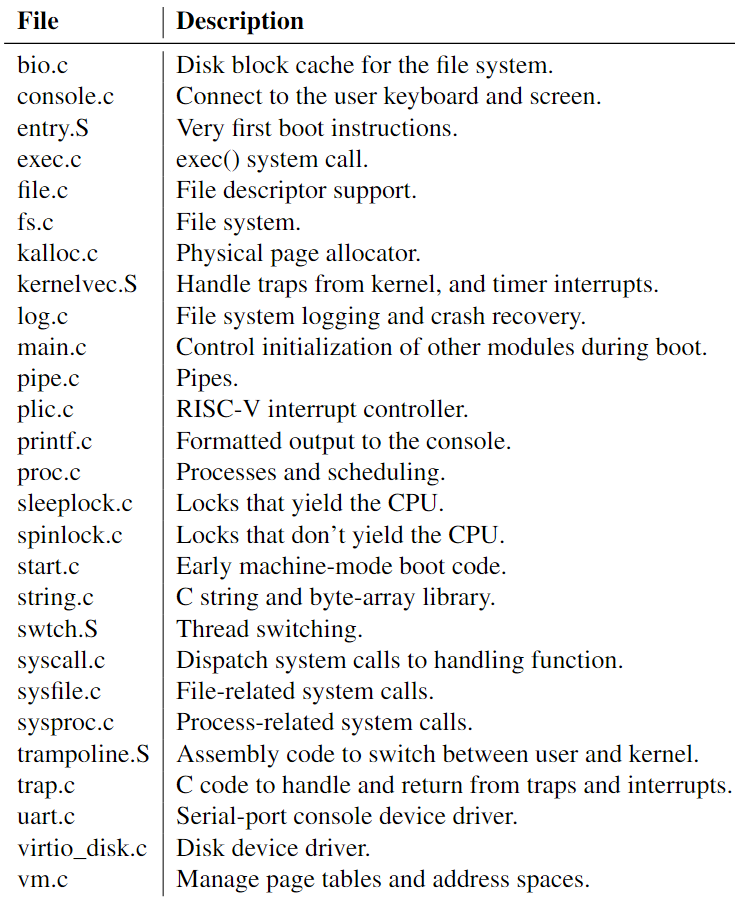
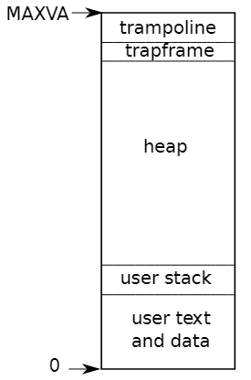

# Chapter 2 操作系统的组织（Perating system organization）

一个操作系统的关键需求是支持同时进行多个活动。例如，使用第1章中描述的系统调用接口，一个进程可以使用`fork`启动新的进程。操作系统必须在这些进程之间分时共享计算机的资源。例如，即使进程的数量多于硬件CPU的数量，操作系统也必须确保所有进程都有机会执行。操作系统还必须安排进程之间的隔离。也就是说，如果一个进程有一个错误并且故障，不应该影响到那些不依赖于这个有问题的进程的其他进程。然而，完全的隔离过于严格，因为进程之间应该可以有意地进行交互；管道就是一个例子。因此，一个操作系统必须满足三个要求：多路复用、隔离和交互。

本章概述了操作系统如何组织以实现这三个要求。事实证明，有许多方法可以做到这一点，但本文集中在围绕单一内核（monolithic kernel）的主流设计上，许多Unix操作系统都采用这种设计。本章还概述了xv6进程，这是xv6中隔离的基本单元，以及xv6启动时第一个进程的创建。Xv6运行在多核的RISC-V微处理器上，其许多低级功能（例如，进程实现）特定于RISC-V。RISC-V是一种64位CPU，而xv6用“LP64”C语言编写，这意味着在C语言中，长整型（long）和指针（pointer）是64位的，而整型（int）是32位的。

本书假定读者在某些体系结构上进行过一些机器级编程，并将在出现时引入RISC-V特定的概念。关于RISC-V的一个有用的参考资料是"The RISC-V Reader: An Open Architecture Atlas"。用户级ISA和特权架构是官方规范。完整计算机中的CPU被支持硬件包围，其中大部分是以I/O接口的形式存在的。Xv6是为由qemu的"-machine virt"选项模拟的支持硬件编写的。这包括RAM、包含引导代码的ROM、与用户键盘/屏幕的串行连接以及用于存储的磁盘。

## 2.1 抽象物理资源 （Abstracting physical resources）

遇到操作系统时，人们可能首先会问，为什么需要操作系统？也就是说，可以将图1.2中的系统调用实现为一个库，应用程序可以链接这个库。按照这种计划，每个应用程序甚至可以有自己定制的库来满足自己的需求。应用程序可以直接与硬件资源交互，并以对应用程序来说最好的方式使用这些资源（例如，实现高性能或可预测的性能）。有些嵌入式设备或实时系统的操作系统就是以这种方式组织的。

这种库方法的缺点是，如果有多个应用程序在运行，应用程序必须表现得很好。例如，每个应用程序必须定期放弃CPU，以便其他应用程序可以运行。如果所有应用程序都互相信任并且没有错误，那么这种合作的时间共享方案可能是可以接受的。更常见的情况是，应用程序不相互信任，并且存在错误，所以通常需要比合作方案更强的隔离。

为了实现强隔离，禁止应用程序直接访问敏感的硬件资源是有帮助的，而是将资源抽象为服务。例如，Unix应用程序仅通过文件系统的打开、读取、写入和关闭系统调用与存储交互，而不是直接读取和写入磁盘。这为应用程序提供了路径名的便利，并允许操作系统（作为接口的实现者）管理磁盘。即使隔离不是问题，故意交互的程序（或者只是希望互不干扰的程序）也可能发现文件系统比直接使用磁盘更方便的抽象。

同样，Unix透明地在进程之间切换硬件CPU，必要时保存和恢复寄存器状态，这样应用程序就不必意识到时间共享的存在。这种透明性使操作系统即使在某些应用程序处于无限循环时也能共享CPU。

另一个例子是，Unix进程使用`exec`来构建其内存镜像，而不是直接与物理内存交互。这允许操作系统决定将进程放置在内存中的位置；如果内存紧张，操作系统甚至可能将进程的一些数据存储在磁盘上。`exec`还为用户提供了一个文件系统来存储可执行程序镜像的便利。

许多Unix进程之间的交互通过文件描述符进行。文件描述符不仅抽象了许多细节（例如，管道或文件中的数据存储位置），还以简化交互的方式定义。例如，如果管道中的一个应用程序失败，内核会为管道中的下一个进程生成一个文件结束信号。

图1.2中的系统调用接口经过精心设计，既提供了程序员的便利，又提供了强隔离的可能性。Unix接口不是抽象资源的唯一方式，但它已被证明是一种非常好的方式。

## 2.2 用户模式、监管者模式和系统调用（User mode, supervisor mode, and system calls）

强隔离要求在应用程序和操作系统之间建立一个严格的边界。如果应用程序出错，我们不希望操作系统或其他应用程序失败。相反，操作系统应该能够清理失败的应用程序并继续运行其他应用程序。为了实现强隔离，操作系统必须安排应用程序无法修改（甚至读取）操作系统的数据结构和指令，并且应用程序无法访问其他进程的内存。

CPU 提供了强隔离的硬件支持。例如，RISC-V 在 CPU 执行指令时有三种模式：机器模式、监管者模式和用户模式。在机器模式下执行的指令具有完全特权；CPU 在机器模式下启动。机器模式主要用于配置计算机。Xv6 在机器模式下执行了几行代码，然后切换到监管者模式。

在监管者模式下，CPU 可以执行特权指令：例如，启用和禁用中断，读取和写入保存页面表地址的寄存器等等。如果用户模式中的应用程序尝试执行特权指令，那么 CPU 不会执行该指令，而是切换到监管者模式，以便监管者模式的代码可以终止应用程序，因为它做了不应该做的事情。第 1 章中的图 1.1 说明了这种组织结构。应用程序只能执行用户模式指令（例如，加法等），并称为在用户空间运行，而运行在监管者模式的软件还可以执行特权指令，并称为在内核空间运行。运行在内核空间（或监管者模式）中的软件称为内核。

想要调用内核函数的应用程序（例如，在 xv6 中的read系统调用）必须转换到内核。CPU 提供了一条特殊指令，该指令将 CPU 从用户模式切换到监管者模式，并在内核指定的入口点进入内核。（RISC-V 提供了 ecall 指令用于此目的。）一旦 CPU 切换到监管者模式，内核就可以验证系统调用的参数，决定是否允许应用程序执行请求的操作，然后拒绝或执行该操作。重要的是内核控制转换到监管者模式的入口点；如果应用程序可以决定内核的入口点，那么恶意应用程序可以选择在跳过参数验证的点进入内核。

##  2.3 内核组织(Kernel organization)

一个关键的设计问题是操作系统的哪些部分应该在监管者模式下运行。一个可能性是整个操作系统都驻留在内核中，以便所有系统调用的实现都在监管者模式下运行。这种组织称为单内核。

在这种组织中，整个操作系统都以完全的硬件特权运行。这种组织很方便，因为操作系统设计者不必决定操作系统的哪一部分不需要完全的硬件特权。此外，操作系统的不同部分之间更容易合作。例如，一个操作系统可能有一个可以被文件系统和虚拟内存系统共享的缓冲区缓存。

单内核组织的一个缺点是操作系统不同部分之间的接口通常很复杂（正如我们在本文的其余部分将看到的那样），因此操作系统开发人员很容易犯错误。在单内核中，一个错误是致命的，因为监管者模式下的错误通常会导致内核失败。如果内核失败，计算机就会停止工作，因此所有应用程序也会失败。计算机必须重新启动才能重新开始。

为了减少内核中的错误风险，操作系统设计者可以将运行在监管者模式下的操作系统代码量最小化，并将大部分操作系统在用户模式下执行。这种内核组织称为微内核。

图 2.1 说明了这种微内核设计。在图中，文件系统作为一个用户级进程运行。作为进程运行的操作系统服务称为服务器。为了允许应用程序与文件服务器进行交互，内核提供了进程间通信机制，用于从一个用户模式进程向另一个发送消息。例如，如果像 shell 这样的应用程序想要读取或写入文件，它会向文件服务器发送消息并等待响应。

在微内核中，内核接口由一些低级函数组成，用于启动应用程序、发送消息、访问设备硬件等等。这种组织允许内核相对简单，因为大部分操作系统都驻留在用户级服务器中。

Xv6 是作为一个单内核实现的，像大多数 Unix 操作系统一样。因此，xv6 的内核接口对应于操作系统接口，并且内核实现了完整的操作系统。由于 xv6 并不提供许多服务，因此其内核比一些微内核要小，但在概念上 xv6 是单内核的。

## 2.4 代码：xv6 组织(Code: xv6 organization)

xv6 内核源代码存储在 kernel/ 子目录中。源代码根据一种粗略的模块化概念划分为多个文件；图 2.2 列出了这些文件。模块间的接口在 kernel/defs.h 中定义。

## 2.5 进程概述(Process overview)

在 xv6（和其他 Unix 操作系统）中，隔离的单位是进程。进程抽象防止一个进程破坏或窥探另一个进程的内存、CPU、文件描述符等。它还防止进程破坏内核本身，从而使进程无法破坏内核的隔离机制。内核必须谨慎地实现进程抽象，因为有漏洞或恶意的应用程序可能会诱骗内核或硬件做出错误操作（例如，绕过隔离）。内核用于实现进程的机制包括用户/监督模式标志、地址空间和线程的时间片轮转。

为了帮助强制执行隔离，进程抽象向程序提供了一种它拥有自己的私有机器的假象。进程为程序提供了一个看似私有的内存系统或地址空间，其他进程无法读取或写入。进程还为程序提供了一个看似自己的 CPU 来执行程序的指令。

xv6 使用页表（由硬件实现）为每个进程提供其自己的地址空间。RISC-V 页表将虚拟地址（RISC-V 指令操作的地址）翻译（或“映射”）为物理地址（CPU 芯片发送给主存的地址）。

xv6 为每个进程维护一个单独的页表，该页表定义了该进程的地址空间。如图 2.3 所示，地址空间包括从虚拟地址零开始的进程用户内存。首先是指令，接着是全局变量，然后是堆栈，最后是进程可以根据需要扩展的“堆”区域（用于 malloc）。有许多因素限制了进程地址空间的最大大小：RISC-V 上的指针宽 64 位；硬件在查找页表中的虚拟地址时仅使用低 39 位；而 xv6 仅使用这 39 位中的 38 位。因此，最大地址是 2^38 − 1 = 0x3fffffffff，这就是 MAXVA（kernel/riscv.h:348）。在地址空间的顶部，xv6 为跳板保留一个页，为映射进程的陷阱框架切换到内核保留一个页，这将在第 4 章中解释。

xv6 内核为每个进程维护了许多状态信息，这些状态信息被聚集到一个 struct proc（kernel/proc.h:86）中。一个进程最重要的内核状态包括其页表、其内核堆栈及其运行状态。我们使用符号 p->xxx 来指代 proc 结构的元素；例如，p->pagetable 是指向进程页表的指针。每个进程都有一个执行线程（简称线程）来执行进程的指令。线程可以被挂起并在稍后恢复。为了在进程之间透明地切换，内核挂起当前运行的线程并恢复另一个进程的线程。线程的大部分状态（局部变量、函数调用返回地址）存储在线程的堆栈上。

每个进程有两个堆栈：用户堆栈和内核堆栈（p->kstack）。当进程执行用户指令时，仅使用其用户堆栈，其内核堆栈为空。当进程进入内核（进行系统调用或中断）时，内核代码在进程的内核堆栈上执行；当进程在内核中时，其用户堆栈仍然包含保存的数据，但不会被积极使用。进程的线程在积极使用其用户堆栈和内核堆栈之间交替。内核堆栈是独立的（并且受到用户代码的保护），因此即使进程破坏了其用户堆栈，内核仍可以执行。

进程可以通过执行 RISC-V ecall 指令来进行系统调用。该指令提高硬件特权级别，并将程序计数器更改为内核定义的入口点。入口点的代码切换到内核堆栈并执行实现系统调用的内核指令。当系统调用完成时，内核切换回用户堆栈并通过调用 sret 指令返回用户空间，这降低了硬件特权级别并恢复执行系统调用指令后的用户指令。进程的线程可以在内核中“阻塞”以等待 I/O，并在 I/O 完成后从中断点恢复。

p->state 表示进程是已分配、准备运行、运行中、等待 I/O 还是退出。

p->pagetable 保存了进程的页表，格式符合 RISC-V 硬件的期望。xv6 使分页硬件在用户空间执行进程时使用进程的 p->pagetable。进程的页表还记录了用于存储进程内存的物理页地址。

## 2.6 代码：启动 xv6 和第一个进程(Code: starting xv6 and the first process)

为了使 xv6 更加具体，我们将概述内核如何启动并运行第一个进程。后续章节将更详细地描述在本概述中出现的机制。

当 RISC-V 计算机启动时，它会自我初始化并运行存储在只读存储器中的引导加载程序。引导加载程序将 xv6 内核加载到内存中。然后，在机器模式下，CPU 从 entry (kernel/entry.S:6) 开始执行 xv6。RISC-V 启动时禁用了分页硬件：虚拟地址直接映射到物理地址。

加载程序将 xv6 内核加载到物理地址 0x80000000。将内核放置在 0x80000000 而不是 0x0 的原因是地址范围 0x0:0x80000000 包含 I/O 设备。entry 处的指令设置了一个堆栈，以便 xv6 可以运行 C 代码。Xv6 在文件 start.c (kernel/start.c:11) 中声明了一个初始堆栈 stack0 的空间。

entry 处的代码将堆栈指针寄存器 sp 加载为 stack0+4096 的地址，即堆栈的顶部，因为 RISC-V 上的堆栈是向下增长的。现在内核有了堆栈，entry 进入 C 代码 start (kernel/start.c:21)。

start 函数执行一些仅在机器模式下允许的配置，然后切换到监督模式。为了进入监督模式，RISC-V 提供了 mret 指令。此指令通常用于从监督模式到机器模式的先前调用中返回。start 并不是从这样的调用中返回，而是设置为好像有一个这样的调用：它在寄存器 mstatus 中将先前的特权模式设置为监督模式，将返回地址设置为 main 的地址，通过在页表寄存器 satp 中写入 0 来禁用监督模式下的虚拟地址转换，并将所有中断和异常委托给监督模式。

在跳入监督模式之前，start 执行了最后一项任务：编程时钟芯片以生成定时器中断。完成了这些准备工作后，start 通过调用 mret "返回" 到监督模式。这会使程序计数器更改为 main (kernel/main.c:11)。

在 main (kernel/main.c:11) 初始化了几个设备和子系统之后，它通过调用 userinit (kernel/proc.c:212) 创建第一个进程。第一个进程执行一个用 RISC-V 汇编语言编写的小程序 initcode.S (user/initcode.S:1)，该程序通过调用 exec 系统调用重新进入内核。正如我们在第 1 章中看到的，exec 会用一个新程序（在本例中为 /init）替换当前进程的内存和寄存器。一旦内核完成了 exec，它将返回到用户空间中的 /init 进程。Init (user/init.c:15) 创建一个新的控制台设备文件（如果需要），然后将其作为文件描述符 0、1 和 2 打开。然后它在控制台上启动一个 shell。系统启动完毕。

## 2.7 现实世界(Real world)

在现实世界中，可以找到单片内核和微内核两种结构。许多 Unix 内核是单片内核。例如，Linux 有一个单片内核，尽管有些操作系统功能作为用户级服务器运行（例如，窗口系统）。像 L4、Minix 和 QNX 这样的内核是组织为微内核加服务器的，并且在嵌入式环境中得到了广泛部署。

大多数操作系统都采用了进程概念，并且大多数进程看起来与 xv6 的进程类似。然而，现代操作系统支持在一个进程中包含多个线程，以允许单个进程利用多个 CPU。支持一个进程中的多个线程涉及许多 xv6 没有的机制，包括可能的接口更改（例如，Linux 的 clone，是 fork 的变体），以控制线程共享进程的哪些方面。

## 2.8 练习(Exercises)

1. 你可以使用 gdb 观察第一次内核到用户的转换。运行 make qemu-gdb。在另一个窗口中，在同一目录下运行 gdb。输入 gdb 命令 break *0x3ffffff10e，这将在跳转到用户空间的内核 sret 指令处设置一个断点。输入 continue gdb 命令。gdb 应该会在断点处停止，即将执行 sret。输入 stepi。gdb 现在应该指示它正在地址 0x0 处执行，这是在 initcode.S 开始的用户空间地址。