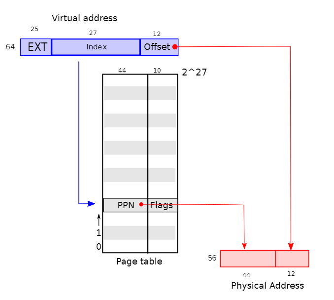
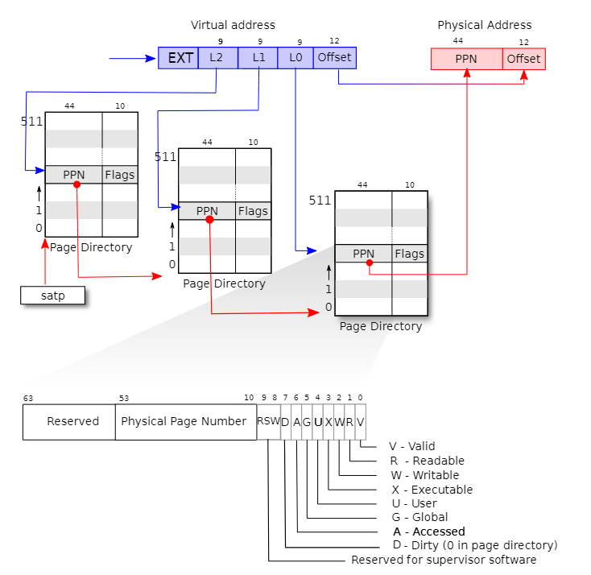
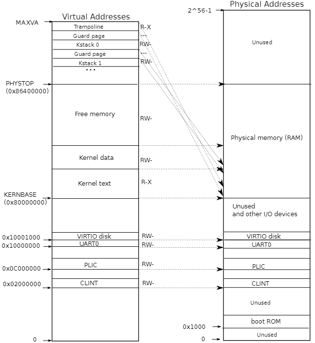
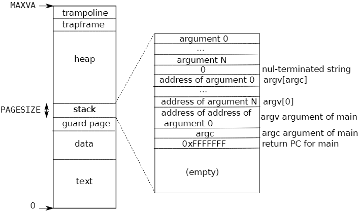

# Chapter 3  页表(Page tables)

​	页表是操作系统为每个进程提供其独立的地址空间和内存的机制。页表决定了内存地址的意义以及哪些部分的物理内存可以被访问。它们使得xv6能够隔离不同进程的地址空间，并将它们多路复用到单个物理内存上。页表还提供了一种间接层，使得xv6可以执行一些技巧：在多个地址空间中映射相同的内存（例如跳板页），并通过未映射的页面来保护内核和用户栈。本章的其余部分将解释RISC-V硬件提供的页表以及xv6如何使用它们。

## 3.1 分页硬件(Paging hardware)

​	提醒一下，RISC-V指令（包括用户和内核指令）操作虚拟地址。机器的RAM或物理内存是通过物理地址索引的。RISC-V的页表硬件通过将每个虚拟地址映射到一个物理地址来连接这两种地址。

​	xv6运行在Sv39 RISC-V上，这意味着64位虚拟地址的最低39位被使用；最高的25位未被使用。在这种Sv39配置中，RISC-V页表逻辑上是一个包含`2^27（134,217,728）`个页表项（PTE）的数组。每个PTE包含一个44位的物理页号（PPN）和一些标志位。分页硬件通过使用39位中的最高27位来索引页表以找到一个PTE，并生成一个56位的物理地址，其最高44位来自PTE中的PPN，最低12位则从原始虚拟地址复制。图3.1展示了这一过程，将页表逻辑上视为一个简单的PTE数组（请参阅图3.2了解更详细的过程）。页表使操作系统能够以4096（2^12）字节对齐的块为粒度控制虚拟到物理地址的转换。这样的块被称为页。

​	在Sv39 RISC-V中，虚拟地址的最高25位不用于转换；未来，RISC-V可能会使用这些位来定义更多级别的转换。物理地址也有扩展的空间：PTE格式中有空间让物理页号增加另外10位。




​	如图 3.2 所示，实际的地址转换分为三个步骤。页表在物理内存中存储为一个三层树结构。树的根是一个4096字节的页表页，包含512个页表项（PTE），这些PTE包含下一层树中的页表页的物理地址。每一层中的页表页包含512个最终层的PTE。分页硬件使用27位地址中的最高9位在根页表页中选择一个PTE，中间的9位在下一层的页表页中选择一个PTE，最低的9位在最终层中选择一个PTE。如果在地址转换过程中需要的三个PTE中有任何一个不存在，分页硬件会引发页面错误异常，由内核处理异常（详见第四章）。这种三层结构允许页表在大范围虚拟地址没有映射的常见情况下省略整个页表页。

​	每个PTE包含标志位，指示分页硬件如何允许使用相关的虚拟地址。PTE_V表示PTE是否存在：如果未设置，引用该页将导致异常（即不允许）。PTE_R控制是否允许指令读取该页。PTE_W控制是否允许指令写入该页。PTE_X控制CPU是否可以将该页的内容解释为指令并执行。PTE_U控制用户模式下的指令是否允许访问该页；如果未设置PTE_U，则PTE只能在管理模式下使用。图 3.2 展示了这一切如何运作。所有的标志和其他页表硬件相关结构都定义在 (kernel/riscv.h) 中。

​	为了告诉硬件使用某个页表，内核必须将根页表页的物理地址写入 satp 寄存器。每个CPU都有自己的satp。CPU将使用其satp指向的页表来转换所有后续指令生成的地址。每个CPU都有自己的satp，以便不同的CPU可以运行不同的进程，每个进程都有一个由其页表描述的独立地址空间。



​	关于术语的一些说明。物理内存指的是DRAM中的存储单元。物理内存的一个字节有一个地址，称为物理地址。指令只使用虚拟地址，分页硬件将其转换为物理地址，然后发送到DRAM硬件以读取或写入存储。与物理内存和虚拟地址不同，虚拟内存不是一个物理对象，而是指内核为管理物理内存和虚拟地址所提供的抽象和机制的集合。

## 3.2 内核地址空间（Kernel address space）

​	xv6为每个进程维护一个页表，描述了每个进程的用户地址空间，还有一个单独的页表描述了内核的地址空间。内核配置其地址空间的布局，以便在可预测的虚拟地址上为自己提供对物理内存和各种硬件资源的访问。图 3.3 显示了这种布局如何将内核虚拟地址映射到物理地址。文件 (kernel/memlayout.h) 声明了 xv6 内核内存布局的常量。QEMU 模拟的计算机包括从物理地址 0x80000000 开始并持续到至少 0x86400000 的 RAM（物理内存），xv6 将其称为 PHYSTOP。

​	QEMU 模拟还包括诸如磁盘接口等 I/O 设备。QEMU 将设备接口公开给软件作为内存映射的控制寄存器，这些寄存器位于物理地址空间中 0x80000000 以下。内核可以通过读取/写入这些特殊的物理地址与设备进行交互；这样的读取和写入与设备硬件通信，而不是与 RAM 通信。第四章解释了 xv6 如何与设备交互。



​	内核本身位于虚拟地址空间和物理内存中的 KERNBASE=0x80000000 处。直接映射简化了读取或写入物理内存的内核代码。例如，当 fork 为子进程分配用户内存时，分配器返回该内存的物理地址；fork 在将父进程的用户内存复制到子进程时直接使用该地址作为虚拟地址。

有一些内核虚拟地址不是直接映射的：

- 跳板页。它被映射到虚拟地址空间的顶部；用户页表也具有相同的映射。第四章讨论了跳板页的作用，但在这里我们看到了页表的一个有趣的用例；一个物理页面（保存着跳板代码）在内核的虚拟地址空间中被映射了两次：一次在虚拟地址空间的顶部，一次进行直接映射。
- 内核栈页。每个进程都有自己的内核栈，它被映射到较高的位置，以便在其下方 xv6 可以留下一个未映射的守护页。守护页的 PTE 是无效的（即，PTE_V 没有设置），因此如果内核溢出了内核栈，它很可能会引发异常，导致内核恐慌。如果没有守护页，溢出的栈会覆盖其他内核内存，导致操作不正确。宁愿发生恐慌崩溃。

​	虽然内核通过高内存映射使用它的栈，但它们也可以通过直接映射地址对内核进行访问。另一种设计可能只有直接映射，并在直接映射的地址上使用栈。然而，在这种安排中，提供守护页将涉及取消映射否则将引用物理内存的虚拟地址，这将难以使用。

​	内核使用权限 PTE_R 和 PTE_X 将跳板页和内核文本页映射到页面，并从这些页面读取和执行指令。内核使用权限 PTE_R 和 PTE_W 将其他页面映射到页面，以便它可以读取和写入这些页面的内存。守护页的映射无效。

## 3.3 代码：创建地址空间(Code: creating an address space)

​	大部分用于操作地址空间和页表的 xv6 代码位于 vm.c 中。其中心数据结构是 pagetable_t，实际上是一个指向 RISC-V 根页表页的指针；pagetable_t 可能是内核页表，也可能是每个进程的页表之一。中心函数是 walk，它找到虚拟地址的 PTE，以及 mappages，它为新映射安装 PTE。以 kvm 开头的函数操作内核页表；以 uvm 开头的函数操作用户页表；其他函数都用于两者。copyout 和 copyin 将数据复制到系统调用参数提供的用户虚拟地址中，它们在 vm.c 中，因为它们需要明确转换这些地址以找到相应的物理内存。

​	在引导序列的早期，main 调用 kvminit 创建内核的页表。这个调用发生在 xv6 在 RISC-V 上启用分页之前，所以地址直接引用物理内存。Kvminit 首先分配一个物理内存页面来容纳根页表页。然后它调用 kvmmap 来安装内核需要的转换。这些转换包括内核的指令和数据、PHYSTOP 之前的物理内存以及实际上是设备的内存范围。

​	kvmmap 调用 mappages，为一系列虚拟地址到相应的物理地址的范围安装映射。它为范围中的每个虚拟地址分别进行操作，以页为间隔。对于要映射的每个虚拟地址，mappages 调用 walk 来找到该地址的 PTE 地址。然后，它初始化 PTE，以包含相关的物理页号、所需的权限（PTE_W、PTE_X 和/或 PTE_R）以及 PTE_V 标记 PTE 为有效。

​	walk函数模拟了RISC-V分页硬件查找虚拟地址的PTE的过程（见图3.2）。walk函数一次降级3级页表9位。它使用每个级别的9位虚拟地址来查找下一级页表或最终页的PTE。如果PTE无效，那么所需的页面尚未分配；如果设置了alloc参数，walk会分配一个新的页表页面，并将其物理地址放入PTE中。它返回树中最底层的PTE的地址。

​	上述代码依赖于物理内存直接映射到内核虚拟地址空间中。例如，当walk降级页表的级别时，它从PTE中获取下一级页表的（物理）地址，然后使用该地址作为虚拟地址来获取下一级页表中的PTE。

main调用kvminithart来安装内核页表。它将根页表页的物理地址写入寄存器satp中。之后，CPU将使用内核页表来转换地址。由于内核使用身份映射，下一条指令的虚拟地址现在将映射到正确的物理内存地址。

​	procinit在调用main时为每个进程分配一个内核栈。它将每个栈映射到由KSTACK生成的虚拟地址上，这为无效的栈守护页留出了空间。kvmmap向内核页表添加映射PTE，并调用kvminithart重新加载内核页表到satp中，以便硬件了解新的PTE。

​	每个RISC-V CPU在一个TLB（Translation Look-aside Buffer）中缓存页表项，当xv6更改页表时，必须告诉CPU使相应的缓存TLB项无效。如果没有这样做，那么在稍后的某个时候，TLB可能会使用旧的缓存映射，指向在此期间已经分配给另一个进程的物理页面，结果可能是一个进程可能会写入另一个进程的内存。RISC-V具有一个指令sfence.vma，用于刷新当前CPU的TLB。xv6在重新加载satp寄存器后执行kvminithart中的sfence.vma，并在切换到用户页表之前返回用户空间的跳板代码（kernel/trampoline.S:79）中执行sfence.vma。

## 3.4 物理内存分配(Physical memory allocator)

​	内核必须在运行时为页表、用户内存、内核栈和管道缓冲区分配和释放物理内存。xv6使用内核结束和PHYSTOP之间的物理内存进行运行时分配。它一次分配和释放整个4096字节的页面。它通过在页面本身之间穿过一个链接列表来跟踪哪些页面是空闲的。分配包括从链接列表中移除一个页面；释放包括将释放的页面添加到列表中。

## 3.5 代码：物理内存分配器(Code: Physical memory allocator)

​	分配器位于kalloc.c（kernel/kalloc.c:1）。分配器的数据结构是一个可分配的物理内存页的空闲列表。每个空闲页的列表元素是一个结构体run（kernel/kalloc.c:17）。分配器从哪里获得内存来保存这个数据结构？它将每个空闲页的run结构存储在空闲页本身，因为那里没有存储其他东西。空闲列表由一个自旋锁保护（kernel/kalloc.c:21-24）。列表和锁被包装在一个结构体中，以明确锁保护结构体中的字段。目前，忽略锁和对acquire和release的调用；第六章将详细讨论锁定。

​	函数main调用kinit来初始化分配器（kernel/kalloc.c:27）。kinit初始化空闲列表，以包含内核结束和PHYSTOP之间的所有页面。xv6应该通过解析硬件提供的配置信息来确定可用的物理内存量。但xv6假设机器有128兆字节的RAM。kinit调用freerange通过对每页调用kfree来将内存添加到空闲列表中。PTE只能引用在4096字节边界上对齐的物理地址（是4096的倍数），因此freerange使用PGROUNDUP确保它只释放对齐的物理地址。分配器开始时没有内存；这些对kfree的调用为它提供了一些管理的内存。

​	分配器有时将地址视为整数以进行算术运算（例如，在freerange中遍历所有页面），有时将地址用作指针以读取和写入内存（例如，操作存储在每个页面中的run结构）；地址的这种双重用途是分配器代码中充满C类型转换的主要原因。另一个原因是释放和分配本质上改变了内存的类型。

​	函数kfree（kernel/kalloc.c:47）首先将要释放的内存中的每个字节设置为值1。这将导致在释放后使用内存的代码（使用“悬空引用”）读取无效内容而不是旧的有效内容；希望这会更快地使这样的代码崩溃。然后kfree将页面预置到空闲列表：它将pa转换为指向struct run的指针，将空闲列表的旧起点记录在r->next中，并将空闲列表设置为r。kalloc移除并返回空闲列表中的第一个元素。

## 3.6 进程地址空间(Process address space)

​	每个进程都有一个独立的页表，当xv6在进程之间切换时，也会切换页表。如图2.3所示，一个进程的用户内存从虚拟地址0开始，可以增长到MAXVA（kernel/riscv.h:348），原则上允许进程寻址256 GB的内存。当一个进程请求xv6更多的用户内存时，xv6首先使用kalloc分配物理页。然后它将指向新物理页的PTE添加到进程的页表中。xv6在这些PTE中设置了PTE_W、PTE_X、PTE_R、PTE_U和PTE_V标志。大多数进程并不会使用整个用户地址空间；xv6会在未使用的PTE中保持PTE_V为空。

​	这里我们看到页表的一些好的应用示例。首先，不同进程的页表将用户地址转换为不同的物理内存页，因此每个进程都有私有的用户内存。其次，每个进程看到的内存是从零开始的连续虚拟地址，而进程的物理内存可以是不连续的。第三，内核在用户地址空间的顶部映射了一个包含跳板代码的页，因此一个物理内存页会出现在所有地址空间中。

​	图3.4更详细地展示了xv6中一个执行进程的用户内存布局。栈是一个单页，并显示了由exec创建的初始内容。包含命令行参数的字符串以及指向它们的指针数组位于栈的最顶端。紧接着的是一些值，使程序可以从main函数开始，就像刚刚调用了main(argc, argv)函数一样。



​	为了检测用户栈溢出分配的栈内存，xv6在栈的正下方放置了一个无效的保护页。如果用户栈溢出并尝试使用栈下方的地址，由于映射无效，硬件将产生一个页面错误异常。现实世界中的操作系统可能会在用户栈溢出时自动分配更多的内存给用户栈。

## 3.7 代码：sbrk （Code: sbrk）

​	sbrk是一个进程用于缩小或扩展其内存的系统调用。该系统调用由函数growproc（kernel/proc.c:239）实现。根据n是正还是负，growproc调用uvmalloc或uvmdealloc。uvmalloc（kernel/vm.c:229）使用kalloc分配物理内存，并通过mappages将PTE添加到用户页表中。uvmdealloc调用uvmunmap（kernel/vm.c:174），它使用walk查找PTE并使用kfree释放它们所指向的物理内存。

​	xv6不仅使用进程的页表来告诉硬件如何映射用户虚拟地址，还将其作为记录哪些物理内存页分配给该进程的唯一记录。这就是为什么释放用户内存（在uvmunmap中）需要检查用户页表的原因。

## 3.8 代码：exec（Code: exec）

​	Exec是创建地址空间用户部分的系统调用。它从文件系统中的文件初始化地址空间的用户部分。Exec（kernel/exec.c:13）使用namei（kernel/exec.c:26）打开命名的二进制路径，namei在第8章中有解释。然后，它读取ELF头。Xv6应用程序使用广泛使用的ELF格式描述，ELF格式在kernel/elf.h中定义。ELF二进制包括ELF头（struct elfhdr，kernel/elf.h:6）后跟一系列程序段头（struct proghdr，kernel/elf.h:25）。每个proghdr描述必须加载到内存中的应用程序的一个部分；xv6程序只有一个程序段头，但其他系统可能会为指令和数据使用单独的部分。

​	第一步是快速检查文件是否可能包含一个ELF二进制。ELF二进制以四字节的“魔术数字”0x7F，'E'，'L'，'F'，或ELF_MAGIC（kernel/elf.h:3）开头。如果ELF头有正确的魔术数字，exec假定该二进制文件格式正确。

​	Exec使用proc_pagetable（kernel/exec.c:38）分配一个没有用户映射的新页表，使用uvmalloc（kernel/exec.c:52）为每个ELF段分配内存，并使用loadseg（kernel/exec.c:10）将每个段加载到内存中。loadseg使用walkaddr查找已分配内存的物理地址，以便写入ELF段的每一页，并使用readi从文件中读取数据。

​	/init的程序段头，是使用exec创建的第一个用户程序，看起来像这样：

```
# objdump -p _init 
user/_init: file format elf64-littleriscv 
Program Header: 
	LOAD off 0x00000000000000b0 vaddr 0x0000000000000000 
									paddr 0x0000000000000000 align 2**3 
         filesz 0x0000000000000840 memsz 0x0000000000000858 flags rwx 
    STACK off 0x0000000000000000 vaddr 0x0000000000000000 
    								paddr 0x0000000000000000 align 2**4 
    	 filesz 0x0000000000000000 memsz 0x0000000000000000 flags rw-
```

​	程序段头的filesz可能小于memsz，这表明它们之间的间隙应该用零填充（用于C全局变量），而不是从文件中读取。对于/init，filesz是2112字节，而memsz是2136字节，因此uvmalloc分配足够的物理内存来容纳2136字节，但仅从文件/init中读取了2112字节。

​	现在exec分配并初始化用户栈。它只分配一个栈页。Exec将参数字符串逐个复制到栈顶，将它们的指针记录在ustack中。它在将传递给main的argv列表的末尾放置一个空指针。ustack的前三个条目是虚拟返回程序计数器、argc和argv指针。

​	Exec在栈页的下方放置一个不可访问的页面，以便尝试使用多于一个页面的程序会导致故障。这个不可访问的页面还允许exec处理过大的参数；在这种情况下，exec用于将参数复制到栈的copyout（kernel/vm.c:355）函数将注意到目标页面不可访问，并返回-1。

​	在准备新的内存映像期间，如果exec检测到像无效程序段之类的错误，它会跳转到标签bad，释放新的映像，并返回-1。exec必须等待释放旧映像，直到确保系统调用成功为止：如果旧映像消失，系统调用将无法向其返回-1。exec中唯一的错误情况发生在映像创建期间。一旦映像完成，exec就可以承诺使用新的页表（kernel/exec.c:113）并释放旧的页表（kernel/exec.c:117）。

​	Exec从ELF文件中加载字节到指定的内存地址。用户或进程可以将任何地址放入ELF文件中。因此，exec是有风险的，因为ELF文件中的地址可能会意外地或故意地指向内核。对于一个不谨慎的内核，后果可能从崩溃到内核隔离机制的恶意破坏（即安全漏洞）不等。xv6执行了许多检查来避免这些风险。例如，if(ph.vaddr + ph.memsz < ph.vaddr)检查总和是否溢出了64位整数。危险在于用户可能构造一个ELF二进制文件，其中ph.vaddr指向用户选择的地址，而ph.memsz足够大以至于总和溢出到0x1000，这将看起来像一个有效值。在旧版本的xv6中，用户地址空间也包含内核（但在用户模式下不可读/写），用户可以选择一个对应于内核内存的地址，从而将ELF二进制数据复制到内核中。在xv6的RISC-V版本中，这种情况不会发生，因为内核有自己单独的页表；loadseg加载到进程的页表中，而不是内核的页表中。

​	内核开发人员很容易忽略一个关键检查，而现实世界的内核长期以来一直缺少这样的检查，缺少这些检查可能被用户程序利用以获得内核特权。很可能xv6没有完全验证供给内核的用户级数据，一个恶意的用户程序可能会利用这一点来规避xv6的隔离。

## 3.9 **现实世界**（Real world）

​	与大多数操作系统一样，xv6利用分页硬件进行内存保护和映射。大多数操作系统通过结合分页和页错误异常来更复杂地使用分页，我们将在第4章中讨论这一点。

​	xv6的简化体现在内核使用虚拟地址和物理地址之间的直接映射，以及假设物理RAM位于地址0x8000000处，内核期望加载到那里。这在QEMU上可以工作，但在真实硬件上却是一个不好的想法；真实硬件将RAM和设备放置在不可预测的物理地址上，因此（例如）可能没有RAM位于xv6期望能够存储内核的0x8000000地址处。更严肃的内核设计利用页表将任意硬件物理内存布局转换为可预测的内核虚拟地址布局。

​	RISC-V支持在物理地址级别上的保护，但xv6不使用该功能。对于内存很多的机器，使用RISC-V对“超级页”的支持可能是有意义的。当物理内存较小时，小页面是有意义的，以允许使用细粒度进行分配和页面交换到磁盘。例如，如果一个程序只使用了8千字节的内存，那么给它整个4兆字节的物理内存超级页是浪费的。在具有大量RAM的机器上，较大的页面是有意义的，并且可能减少页表操作的开销。

​	xv6内核缺乏类似于malloc的分配器，无法为小对象提供内存，这阻止了内核使用需要动态分配的复杂数据结构。

​	内存分配是一个永恒的热门话题，基本问题是高效利用有限的内存并为未知的未来请求做准备。如今人们更关注速度而不是空间效率。此外，一个更复杂的内核可能会分配许多不同大小的小块，而不是（像在xv6中一样）只有4096字节的块；一个真正的内核分配器需要处理小型分配以及大型分配。

## 3.10 练习

1. 解析 RISC-V 的设备树以找到计算机的物理内存量。
2. 编写一个用户程序，通过调用 sbrk(1) 来将其地址空间增加一字节。运行该程序并检查调用 sbrk 之前和之后的程序的页表。内核分配了多少空间？新内存的 PTE 包含什么？
3. 修改 xv6 以在内核中使用超级页。
4. 修改 xv6，使得当用户程序解引用空指针时，它将收到一个异常。也就是说，修改 xv6 以便用户程序不会映射虚拟地址 0。
5. Unix 的 exec 实现传统上会对 shell 脚本进行特殊处理。如果要执行的文件以文本 #! 开头，则第一行被视为要运行的解释该文件的程序。例如，如果 exec 被调用来运行 myprog arg1，而 myprog 的第一行是 #!/interp，则 exec 将以命令行 /interp myprog arg1 运行 /interp。在 xv6 中实现对此约定的支持。
6. 为内核实现地址空间随机化。