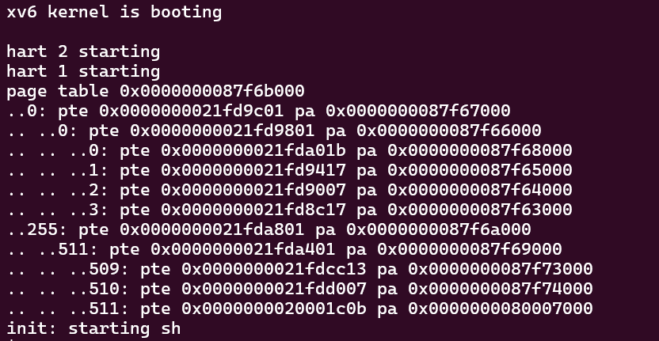
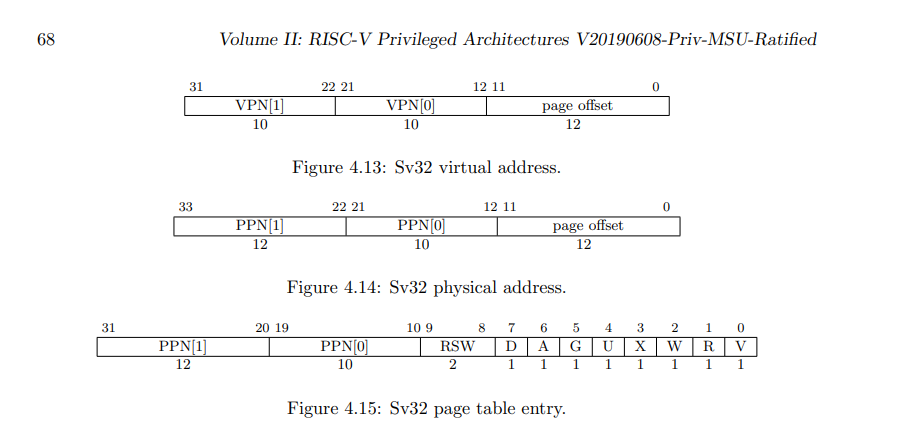

# Lab 3: page tables

> 实验原文地址：[Lab: page tables (mit.edu)](https://pdos.csail.mit.edu/6.S081/2022/labs/pgtbl.html)

在这个实验中，你将探索页面表并修改它们以加速特定的系统调用，并检测哪些页面已被访问。

> [!warning]
> 在你开始编码之前，请阅读 xv6 书的第三章以及相关文件：
>
> - kernel/memlayout.h，其中包含内存布局的信息。
> - kernel/vm.c，其中包含大部分虚拟内存（VM）代码。
> - kernel/kalloc.c，其中包含分配和释放物理内存的代码。 同时，参考 RISC-V 特权架构手册可能也会有所帮助。

要开始实验，请切换到 pgtbl 分支：

```bash
$ git fetch 
$ git checkout pgtbl 
$ make clean
```

## Speed up system calls ([easy](https://pdos.csail.mit.edu/6.S081/2023/labs/guidance.html))

### 实验要求翻译

一些操作系统（例如Linux）通过在用户空间和内核之间共享一块只读空间来加速某些特定的系统调用。这消除了执行这些系统调用时需要内核交叉的需求。为了帮助你学习如何将映射插入到页面表中，你的第一个任务是为 xv6 中的 getpid() 系统调用实现这种优化。

> [!important]
>
> 在每个进程创建时，在 USYSCALL（在 memlayout.h 中定义的一个虚拟地址）处映射一个只读页面。在这个页面的开头，存储一个 struct usyscall（也在 memlayout.h 中定义），并将其初始化为存储当前进程的 PID。在这个实验中，ugetpid() 已经在用户空间中提供，并将自动使用 USYSCALL 映射。如果运行 pgtbltest 时 ugetpid 测试用例通过，则你将获得此实验的完整学分。

一些提示：

- 你可以在 kernel/proc.c 中的 proc_pagetable() 中执行映射。 
- 选择允许用户空间只读取页面的权限位。 
- 你可能会发现 mappages() 是一个有用的实用程序。 
- 不要忘记在 allocproc() 中分配和初始化页面。 确保在 freeproc() 中释放页面。

> [!important]
>
> ChatGPT 你还可以使用共享页面加速哪些其他 xv6 系统调用？请解释一下。

### 实验操作

进行实操前需要回答几个问题：

1. usyscall这个结构体需要存在哪里
2. 需要建立虚拟地址与物理地址的映射，物理地址要怎么获取？
3. 初始化与释放需要做什么？

#### step1 

在 `proc.h`中声明一个`usyscall`结构体，用于存放共享页面。


#### step2 

在(`kernel/proc.c`)中修改`allocproc`方法，仿照给`trapframe`为`p->usyscall` 分配具体的物理地址，并且将进程的pid 保存到这个结构体之中。

```c
  // Allocate a usyscall page
  //这里的地址其实就是一个物理地址，是需要在用户页表中与逻辑地址进行映射的的地址
  if((p->usyscall = (struct usyscall *)kalloc())==0){
    freeproc(p);
    release(&p->lock);
    return 0;
  }
  p->usyscall->pid = p->pid;
```

> 在 xv6 中，内核通过 `kalloc()` 来分配物理内存页面。

#### step3

在`(kernel/proc.c)`中修改`proc_pagetable`方法，仿照给`trapframe`新增映射关系，这里实验有要求许用户空间只读取页面的权限位，所以使用权限`PTE_R`与`PTE_U`

```c
  if(mappages(pagetable,USYSCALL,PGSIZE,(uint64)(p->usyscall), PTE_R | PTE_U) < 0){
    uvmunmap(pagetable, USYSCALL, 1, 0);
    uvmfree(pagetable, 0);
    return 0;
  }
```

#### step4

在(`kernel/proc.c`)中修改`freeproc`与`proc_freepagetable`，在进程释放的时候将对应内存释放掉。

`freeproc`中增加

```c
static void
freeproc(struct proc *p)
{
  //新增代码 begin
  if(p->usyscall)
    kfree((void*)p->usyscall);
  p->usyscall = 0;
  //新增代码 end
  if(p->trapframe)
    kfree((void*)p->trapframe);
  p->trapframe = 0;
  if(p->pagetable)
    proc_freepagetable(p->pagetable, p->sz);
  .....省略
}
```

`proc_freepagetable`中增加

```c
void
proc_freepagetable(pagetable_t pagetable, uint64 sz)
{
  //为什么这里不释放会导致panic: freewalk: leaf
  uvmunmap(pagetable, USYSCALL, 1, 0); //新增行
  uvmunmap(pagetable, TRAMPOLINE, 1, 0);
  uvmunmap(pagetable, TRAPFRAME, 1, 0);
  uvmfree(pagetable, sz);
}

```

#### 总结

由step2可以看出内核中其实是可以直接进行物理内存的操作，包括分配内存，和写入数据。那么这里就有个人有个疑问就是，逻辑地址的重要性到现在体现的还不是很明显，这个问题还有待回答。

还有就是step4中为什么不释放USYSCALL所在内存会导致panic？freeproc这个方法在进程的生命周期的哪个阶段会被调用，一个进程的所有内存没被全部释放掉会导致什么问题？

以上疑问有待解决。

## Print a page table ([easy](https://pdos.csail.mit.edu/6.S081/2022/labs/guidance.html))

### 实验要求翻译

为了帮助你形象化 RISC-V 的页表，并可能帮助未来的调试工作，你的第二个任务是编写一个函数，打印页表的内容。

> [!important]
>
> 定义一个名为 `vmprint()` 的函数。它应该接受一个 `pagetable_t` 参数，并以下述格式打印该页表。在 `exec.c` 中的 `return argc` 之前插入 `if(p->pid==1) vmprint(p->pagetable)`，以打印第一个进程的页表。如果通过 `make grade` 中的页表项打印测试，则你将获得此部分实验的全部学分。

当你启动xv6的时候它应该输出以下内容，描述在第一个进程刚刚完成执行 `init` 的 `exec()` 时的页表。

```
page table 0x0000000087f6b000
 ..0: pte 0x0000000021fd9c01 pa 0x0000000087f67000
 .. ..0: pte 0x0000000021fd9801 pa 0x0000000087f66000
 .. .. ..0: pte 0x0000000021fda01b pa 0x0000000087f68000
 .. .. ..1: pte 0x0000000021fd9417 pa 0x0000000087f65000
 .. .. ..2: pte 0x0000000021fd9007 pa 0x0000000087f64000
 .. .. ..3: pte 0x0000000021fd8c17 pa 0x0000000087f63000
 ..255: pte 0x0000000021fda801 pa 0x0000000087f6a000
 .. ..511: pte 0x0000000021fda401 pa 0x0000000087f69000
 .. .. ..509: pte 0x0000000021fdcc13 pa 0x0000000087f73000
 .. .. ..510: pte 0x0000000021fdd007 pa 0x0000000087f74000
 .. .. ..511: pte 0x0000000020001c0b pa 0x0000000080007000
init: starting sh
```

第一行显示了 `vmprint` 的参数。之后每个PTE（页表项）都有一行，包括指向页表树中更深层的PTE。每行的页表项使用几个“..”缩进用于表明其在页表树中的深度。每行PTE显示PTE在其所在页表中的索引，比特位，以及从页表项中提取的物理地址。不要打印无效的页表项。在上面的例子中顶层页表页对条目 0 和 255 进行了映射。下一级对于条目 0 仅映射了索引 0，而该索引 0 的底层页表页有条目 0、1 和 2 进行了映射。

你的代码可能会显示与上面不同的物理地址。但是这些条目和虚拟地址应该是相同的。

一些提示：

- 你可以在 将`vmprint()`放在`kernel/vm.c`中 
- 使用文件 `kernel/riscv.h` 末尾的宏。
- 方法`freewalk`也许会有启发。
- 在 `kernel/defs.h` 中定义 `vmprint` 的原型，这样你就可以从 `exec.c` 中调用它。
- 在 `printf` 调用中使用 `%p` 来以完整的 64 位十六进制形式打印页表项和地址，就像示例中所示的一样

> [!important]
>
> 解释 `vmprint` 的输出与文本中的图 3-4 的关系。页面 0 包含什么？页面 2 中有什么？在用户模式下，进程能读/写页面 1 映射的内存吗？倒数第三页包含什么？

### 实验操作

#### step1

在vmprint中，参照freewalk实现。

```c
//提前将点保存好，可以减少写if else
static char *point[] = {
  [0] = "..",
  [1] = ".. ..",
  [2] = ".. .. ..",
};

void vmprint(pagetable_t pagetable,uint64 level){
  //打印最顶层的页表信息
  if(level == 1){
    printf("page table %p\n",pagetable);
  }
  //遍历页表项 2^9 = 512 所以一个页表中应该有512个页表项
  for(int i = 0;i<512;i++){
    pte_t pte = pagetable[i];
    if(pte & PTE_V){
      //由方法名可以得出这个child其实就是pte对应的物理地址
      uint64 child = PTE2PA(pte);
      printf("%s%d: pte %p pa %p\n",point[level-1],i,pte,child);
      //页表树层级总共就三层，再继续递归会导致出错
      if(level!=3){
        vmprint((pagetable_t)child,level+1);
      }
    } else if(pte & PTE_V){
      panic("vmprint: leaf");
    }
  }
}
```

#### step2

在`defs.h`中增加`vmprint`声明

```c
// vm.c
void            kvminit(void);
void            kvminithart(void);
void            kvmmap(pagetable_t, uint64, uint64, uint64, int);
int             mappages(pagetable_t, uint64, uint64, uint64, int);
pagetable_t     uvmcreate(void);
void            uvmfirst(pagetable_t, uchar *, uint);
uint64          uvmalloc(pagetable_t, uint64, uint64, int);
uint64          uvmdealloc(pagetable_t, uint64, uint64);
int             uvmcopy(pagetable_t, pagetable_t, uint64);
void            uvmfree(pagetable_t, uint64);
void            uvmunmap(pagetable_t, uint64, uint64, int);
void            uvmclear(pagetable_t, uint64);
pte_t *         walk(pagetable_t, uint64, int);
uint64          walkaddr(pagetable_t, uint64);
int             copyout(pagetable_t, uint64, char *, uint64);
int             copyin(pagetable_t, char *, uint64, uint64);
int             copyinstr(pagetable_t, char *, uint64, uint64);
void            vmprint(pagetable_t,uint64);//新增
```

#### step3

在`exec.c`中调用`vmprint`

```c
  //...省略
  oldpagetable = p->pagetable;
  p->pagetable = pagetable;
  p->sz = sz;
  p->trapframe->epc = elf.entry;  // initial program counter = main
  p->trapframe->sp = sp; // initial stack pointer
  proc_freepagetable(oldpagetable, oldsz);
  //新增代码begin
  //只打印第一个进程的页表
  if(p->pid == 1){
    vmprint(p->pagetable,1);
  }
  //新增代码end
  return argc; // this ends up in a0, the first argument to main(argc, argv)
  //...省略
```

#### 实验结果



#### 总结

实验还是比较容易的，需要注意的是对页表树层级的处理。

## Detect which pages have been accessed ([hard](https://pdos.csail.mit.edu/6.S081/2022/labs/guidance.html))

### 实验要求翻译

一些垃圾回收器（自动内存管理的一种形式）可以从哪些页面已经被访问（读取或写入）的信息中获益。在这一部分的实验，你将给xv6添加一个新特性，通过检测RISC-V 页表中的进入位，检测并向用户空间报告这些信息。RISC-V 硬件页表**遍历器**（walker）在解析 TLB miss 时会将这些位标记在页表项中。

> [!important]
>
> 你的任务是实现 `pgaccess()`，一个报告哪些页面已被访问的系统调用。该系统调用接受三个参数。首先，它接受要检查的第一个用户页的起始虚拟地址。其次，它接受要检查的页数。最后，它接受一个用户地址，用于将结果存储到一个位掩码中（一种数据结构，每页使用一个位，其中第一页对应最低有效位）。当运行 `pgtbltest` 时，如果 `pgaccess` 测试用例通过，你将获得此部分实验的全部学分。

一些建议：

- 阅读 `user/pgtlbtest.c` 中的 `pgaccess_test()`，了解 `pgaccess` 的使用方法。
- 首先，在 `kernel/sysproc.c` 中实现 `sys_pgaccess()`。
-  你需要使用 `argaddr()` 和 `argint()` 来解析参数。 
- 对于输出的位掩码，最好在内核中存储一个临时缓冲区，并在填充正确的位之后将其复制到用户空间（通过 `copyout()`）。 
- 对可以扫描的页数设置一个上限是可以接受的。 
- `kernel/vm.c` 中的 `walk()` 对于查找正确的页表项非常有用。 
- 你需要在 `kernel/riscv.h` 中定义 `PTE_A`，即访问位。请查阅 RISC-V 特权架构手册以确定其值。 
- 确保在检查设置了访问位后清除 `PTE_A`。否则，将无法确定自上次调用 `pgaccess()` 以来是否访问了页面（即，该位将永远被设置）。 
- 在调试页表时，可能会用到 `vmprint()`。

### 实验操作

#### step1

 确定`PTE_A`，访问位在页表项中的位置。



查阅手册可以知道是在第六位。因此在`kernel/riscv.h`中进行如下修改。

```c
...省略
#define PTE_V (1L << 0) // valid
#define PTE_R (1L << 1)
#define PTE_W (1L << 2)
#define PTE_X (1L << 3)
#define PTE_U (1L << 4) // user can access
#define PTE_A (1L << 6) // access bits 新增
...省略
```

#### step2

实现，实验要求代码

```c
int
sys_pgaccess(void)
{
  //接收用户空间传过来的三个参数
  uint64 buf;//这是虚拟地址
  int size ;
  uint64 abits;
  argaddr(0,&buf);
  argint(1,&size);
  argaddr(2,&abits);
  //这里是第四个提示，需要创建一个临时的缓冲区
  int abitss = 0;
  //去获取当前进程
  struct proc *p = myproc();
  for(int i = 0;i<size;i++){
    int va = buf + i * PGSIZE;
    int abit  = 0;
    //从用户空间传过来的是虚拟地址，所以判断这个地址是否被访问过，需要去查页表
    //这里也就体现出来walk函数的作用了，通过虚拟地址查找页表项。
    pte_t *pte = walk(p->pagetable,va,0);
    if(pte == 0)
      return 0;
    //查到对应页表项后，就去检查对应的标志位
    if((*pte & PTE_A) != 0){
      *pte = *pte & (~PTE_A);//清零 pte_a
      abit = 1;
    }
    //将结果保存到缓冲区
    abitss = abitss | abit << i;
  }
  //将结果复制回用户空间
  copyout(p->pagetable,abits,(char *)&abitss,sizeof(abitss));
  return 0;
}
```

#### 总结

这部分实验有点难地方有两个

1. 是要理解，用户空间中所有的变量地址都是虚拟地址，所以在`pgtabltest.c`的调用`pgaccess(buf, 32, &abits) `中buf其实传入的是虚拟地址。所以要想知道一个页面是否被访问过，就需要去查当前进程的页表，这也是提示中为什么说要用walk函数。
2. 在xv6中页面大小是4kb，也就是一个PGSIZE。所以一个页表项记录的是这个4kb大小页面的起始地址。这也就是为什么，代码中每次处理的时候只需要`int va = buf + i * PGSIZE;`按照页面大小一直加就可以。

通过这个实验，可以对虚拟地址，页表项之间的关系有一个很清晰的认识，在用户空间所有的能操作的地址都是虚拟地址，当我们要在内核中进行管理和操作的时候我们可以根据页表对物理内存进行修改。