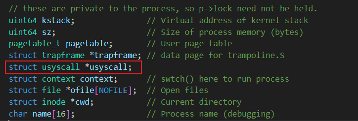

# Lab: page tables

在这个实验中，你将探索页面表并修改它们以加速特定的系统调用，并检测哪些页面已被访问。

> [!warning]
> 在你开始编码之前，请阅读 xv6 书的第三章以及相关文件：
>
> - kernel/memlayout.h，其中包含内存布局的信息。
> - kernel/vm.c，其中包含大部分虚拟内存（VM）代码。
> - kernel/kalloc.c，其中包含分配和释放物理内存的代码。 同时，参考 RISC-V 特权架构手册可能也会有所帮助。

要开始实验，请切换到 pgtbl 分支：

```bash
$ git fetch 
$ git checkout pgtbl 
$ make clean
```

## Speed up system calls ([easy](https://pdos.csail.mit.edu/6.S081/2023/labs/guidance.html))

### 实验要求翻译

一些操作系统（例如Linux）通过在用户空间和内核之间共享一块只读空间来加速某些特定的系统调用。这消除了执行这些系统调用时需要内核交叉的需求。为了帮助你学习如何将映射插入到页面表中，你的第一个任务是为 xv6 中的 getpid() 系统调用实现这种优化。

> [!important]
>
> 在每个进程创建时，在 USYSCALL（在 memlayout.h 中定义的一个虚拟地址）处映射一个只读页面。在这个页面的开头，存储一个 struct usyscall（也在 memlayout.h 中定义），并将其初始化为存储当前进程的 PID。在这个实验中，ugetpid() 已经在用户空间中提供，并将自动使用 USYSCALL 映射。如果运行 pgtbltest 时 ugetpid 测试用例通过，则你将获得此实验的完整学分。

一些提示：

- 你可以在 kernel/proc.c 中的 proc_pagetable() 中执行映射。 
- 选择允许用户空间只读取页面的权限位。 
- 你可能会发现 mappages() 是一个有用的实用程序。 
- 不要忘记在 allocproc() 中分配和初始化页面。 确保在 freeproc() 中释放页面。

> [!important]
>
> ChatGPT 你还可以使用共享页面加速哪些其他 xv6 系统调用？请解释一下。

### 实验操作

进行实操前需要回答几个问题：

1. usyscall这个结构体需要存在哪里
2. 需要建立虚拟地址与物理地址的映射，物理地址要怎么获取？
3. 初始化与释放需要做什么？

#### step1 

在 `proc.h`中声明一个usyscall结构体，用于存放共享页面。



#### step2 

在(`kernel/proc.c`)中修改`allocproc`方法，仿照给`trapframe`为`p->usyscall` 分配具体的物理地址，并且将进程的pid 保存到这个结构体之中。

```C
  // Allocate a usyscall page
  //这里的地址其实就是一个物理地址，是需要在用户页表中与逻辑地址进行映射的的地址
  if((p->usyscall = (struct usyscall *)kalloc())==0){
    freeproc(p);
    release(&p->lock);
    return 0;
  }
  p->usyscall->pid = p->pid;
```

#### step3

在`(kernel/proc.c)`中修改`proc_pagetable`方法，仿照给`trapframe`新增映射关系，这里实验有要求许用户空间只读取页面的权限位，所以使用权限`PTE_R`与`PTE_U`

```C
  if(mappages(pagetable,USYSCALL,PGSIZE,(uint64)(p->usyscall), PTE_R | PTE_U) < 0){
    uvmunmap(pagetable, USYSCALL, 1, 0);
    uvmfree(pagetable, 0);
    return 0;
  }
```

#### step4

在(`kernel/proc.c`)中修改`freeproc`与`proc_freepagetable`，在进程释放的时候将对应内存释放掉。

`freeproc`中增加

```C
 if(p->usyscall)
    kfree((void*)p->usyscall);
  p->usyscall = 0;
```

`proc_freepagetable`中增加

```C
static void
freeproc(struct proc *p)
{
  //新增代码 begin
  if(p->usyscall)
    kfree((void*)p->usyscall);
  p->usyscall = 0;
  //新增代码 end
  if(p->trapframe)
    kfree((void*)p->trapframe);
  p->trapframe = 0;
  .....省略
}
```

