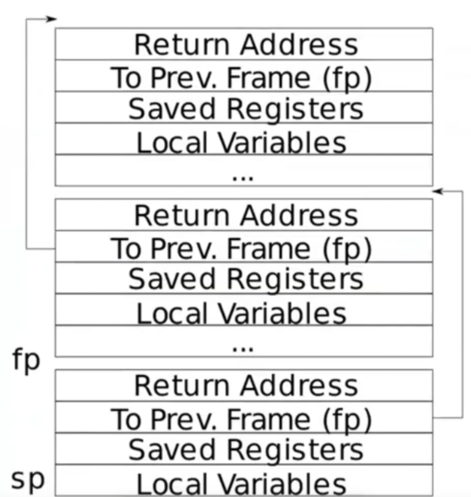

# Lab 4:traps

本实验探索系统调用如何实现陷入。你将使用栈先进行一些热身训练，之后你将实现一个用户计陷入处理的例子。

> [!warning]
> 在你开始编码之前，请阅读 xv6 书的第四章以及相关文件：
>
> - `kernel/trampoline.S`: 涉及从用户空间切换到内核空间以及返回的汇编过程。
> - `kernel/trap.c`: 处理所有中断的代码。

开始实验前，请切换到trap分支:

```bash
  $ git fetch
  $ git checkout traps
  $ make clean
```

## RISC-V assembly ([easy](https://pdos.csail.mit.edu/6.S081/2022/labs/guidance.html))

### 实验要求翻译

理解一些 RISC-V 汇编语言将会很重要，你在6.1910（6.004）课程中已经接触过它。在你的xv6仓库中有一个文件名为`user/call.c`。`make fs.img`编译它，并且会产生一个可阅读的汇编版本的程序在`user/call.asm`中。阅读`call.asm`中的g，f和main方法。RISC-V的说明手册在 [参考页面](https://pdos.csail.mit.edu/6.S081/2022/reference.html)上。以下是你应该回答的一些问题（将答案保存在文件answers-traps.txt中）：

- 哪些寄存器中存放方法中的参数？例如哪个寄存器保存`main`调用`print`打印的13？

  > a0-a7保存了方法中的参数，13保存在了a2寄存器中。

- 汇编代码中的`main`在哪里调用了方法f，在哪里调用了g？（提示：编译器可能会内链函数）

  > 没有调用，g(x)函数被内链到f(x)中，f(x)又被内链到main中。

- 函数`printf`的地址是什么？

  > 0x642
  >
  > 这个地址在汇编代码的这一行，每个人编译后的结果不一定相同
  >
  > 

- 在主函数中执行jalr指令跳转到printf之后，寄存器ra中的值是什么？

  > ra 是return address的缩写，返回地址。
  >
  >  34:	612080e7          	jalr	1554(ra) # 642 `<printf>`
  >
  > jalr 做两步操作：
  >
  > 1. 把pc + 4 的值记为t
  > 2. 把pc的值设置成 $ra + 1554
  > 3. 把ra寄存器的值设置成t
  >
  > 

- 运行以下代码

  ```c
  unsigned int i = 0x00646c72;
  printf("H%x Wo%s", 57616, &i);
  ```

  输出是什么？[这是一个 ASCII 表](https://www.asciitable.com/) 映射字节与字符。

  输出取决于RISC-V采用小端序这一事实。如果RISC-V采用的是大端序，为了得到相同的输出，你需要将i设置为什么值？是否需要将57616更改为不同的值？

  [以下是对小端序和大端序的描述](http://www.webopedia.com/TERM/b/big_endian.html) ，以及[一个更富想象力的描述](https://www.rfc-editor.org/ien/ien137.txt)。

  > 输出是"HE110 World",大端序应该是0x726c6400，不需要将16进制的57616改成别的值。

- 下面的代码中什么会打印在`y=`的后面（答案不是一个特殊值）。为什么会发生这种情况？

  ```c
  printf("x=%d y=%d", 3)	
  ```
  > y是一个随机值，取决于调用前保存y的寄存器中存的是什么值。

## Backtrace ([moderate](https://pdos.csail.mit.edu/6.S081/2022/labs/guidance.html))

### 实验要求翻译

对于调试来说，拥有一个回溯（backtrace）通常是非常有用的：这是一个在错误发生点之上的堆栈中函数调用的列表。为了帮助生成回溯，编译器生成机器代码，该代码在堆栈上维护与当前调用链中每个函数相对应的堆栈帧。每个堆栈帧包含返回地址和一个指向调用者堆栈帧的“帧指针”。寄存器`s0`包含指向当前堆栈帧的指针（实际上它指向堆栈上保存的返回地址的地址加上8）。你的`backtrace`应该使用帧指针来遍历堆栈，并打印每个堆栈帧中保存的返回地址。

> [!important]
>
> 在 `kernel/printf.c` 中实现一个 `backtrace()` 函数。在 `sys_sleep` 中插入对该函数的调用，然后运行 `bttest`，它会调用 `sys_sleep`。你的输出应该是一个返回地址列表，形式如下（但数字可能会有所不同）：
>
> ```
>backtrace:
>     0x0000000080002cda
>    0x0000000080002bb6
>     0x0000000080002898
>```
> 
>在 `bttest` 退出 qemu 后，在终端窗口中运行 `addr2line -e kernel/kernel`（或 `riscv64-unknown-elf-addr2line -e kernel/kernel`），并从你的回溯中剪切和粘贴地址，如下所示：
> 
>```
>  $ addr2line -e kernel/kernel
>    0x0000000080002de2
>     0x0000000080002f4a
>    0x0000000080002bfc
>     Ctrl-D
>```
> 
>你应该会看到类似以下的内容：
> 
>```
> kernel/sysproc.c:74
>kernel/syscall.c:224
> kernel/trap.c:85
>```

一些提示：

- 在 `kernel/defs.h` 中添加 `backtrace()` 的声明，以便你可以在 `sys_sleep` 中调用 `backtrace`。
- GCC 编译器将当前执行函数的帧指针存储在寄存器 `s0` 中。在 `kernel/riscv.h` 中添加以下函数：

  ```c
  static inline uint64
  r_fp()
  {
    uint64 x;
    asm volatile("mv %0, s0" : "=r" (x) );
    return x;
  }
  ```

  并在 `backtrace` 中调用此函数以读取当前帧指针。`r_fp()` 使用内联汇编来读取 `s0`。

- 这些讲义中有一张堆栈帧布局的图片。注意，返回地址位于堆栈帧指针的固定偏移量（-8）处，而保存的帧指针位于堆栈帧指针的固定偏移量（-16）处。

  

- 你的 `backtrace()` 需要一种方法来识别它已经看到了最后一个堆栈帧，并且应该停止。一个有用的事实是，为每个内核堆栈分配的内存由一个单一的页面对齐页组成，因此给定堆栈的所有堆栈帧都在同一页上。你可以使用 `PGROUNDDOWN(fp)`（参见 `kernel/riscv.h`）来识别帧指针所引用的页。

一旦你的 `backtrace` 工作正常，从 `kernel/printf.c` 中的 `panic` 调用它，以便在内核崩溃时看到内核的回溯信息。

### 实验操作

#### step1

在`kernel/defs.h`中增加声明：

```c
// printf.c
void            printf(char*, ...);
void            panic(char*) __attribute__((noreturn));
void            printfinit(void);
void            backtrace(); //新增代码
```

#### step2

在`kernel/riscv.h`增加如下代码：

```c
static inline uint64
r_fp()
{
  uint64 x;
  asm volatile("mv %0, s0" : "=r" (x) );
  return x;
}
```

#### step3

在`kernel/print.c`编写`backtrace方法`

```c
void 
backtrace(){
  //获取当前栈指针的地址
  printf("backtrace: \n");
  uint64 fp = r_fp();
  uint64 up = PGROUNDUP(fp);
  while(fp<up){
    //指针的小用法
    uint64 *frame  = (uint64 *) fp;
    printf("%p \n",frame[-1]);
    fp = frame[-2];
  }
}
```

这里需要注意提示中的`PGROUNDDOWN `与 `PGROUNDUP`是一对方法

- `PGROUNDUP`：将给定地址向上舍入到最近的页面边界。

- `PGROUNDDOWN`：将给定地址向下舍入到最近的页面边界。

尝试使用`PGROUNDDOWN`地址来控制循环，最后总会出现一个多余的地址输出，而改用 `PGROUNDUP`后，输出结果是正确的。

#### step4

在`kernel/sysproc.c`中的`sys_sleep`中增加`backtrace`的调用。

```c
uint64
sys_sleep(void)
{
  int n;
  uint ticks0;
  backtrace();//增加调用
  argint(0, &n);
 。。。
}
```

## 知识补充(by ** **)

- 函数调用栈

  `xv6`中的页面大小为4KB，栈指针保存在`sp`寄存器中。

  

- 栈帧

  当前栈帧的地址保存在 `s0/fp`寄存器里，栈帧指针往下偏移8个字节是函数返回地址 `return address`，往下偏移16个字节是上一个栈帧的栈帧指针(previous frame pointer)

  

  栈从高地址向低地址增长，每个大的`box`叫一个`stack frame`(栈帧)，栈帧由函数调用来分配，每个栈帧大小不一定一样，但是栈帧的最高处一定是`return address`

  `sp`是`stack pointer`，用于指向栈顶(低地址)，保存在寄存器中

  `fp`是`frame pointer`，用于指向当前帧底部(高地址)，保存在寄存器中，同时每个函数栈帧中保存了调用当前函数的函数(父函数)的`fp`(保存在`to prev frame`那一栏中)

  这些栈帧都是由编译器编译生成的汇编文件生成的

## Alarm ([hard](https://pdos.csail.mit.edu/6.S081/2022/labs/guidance.html))

>[!important]
>
> 在这个练习中，你将为xv6添加一个功能，使其定期提醒一个进程在使用CPU时间。这对于希望限制CPU时间消耗的计算密集型进程，或者对于既想进行计算又想定期执行某些操作的进程可能很有用。更广泛地说，你将实现一种用户级中断/故障处理程序的原始形式；例如，你可以使用类似的方法来处理应用程序中的页面错误。如果你的解决方案通过了`alarmtest`和`usertests -q`，那么它就是正确的。

你应该添加一个新的系统调用 `sigalarm(interval, handler)`。如果一个应用程序调用了 `sigalarm(n, fn)`，那么在程序消耗的每 `n` 个 "ticks" 的 CPU 时间后，内核应该调用应用程序函数 `fn`。当 `fn` 返回时，应用程序应该从离开的地方继续执行。在 xv6 中，一个 "tick" 是一个相当任意的时间单位，由硬件定时器生成中断的频率决定。如果应用程序调用了 `sigalarm(0, 0)`，内核应该停止生成周期性的警报调用。

你会在你的 xv6 仓库中找到一个文件 `user/alarmtest.c`。将其添加到 `Makefile` 中。在你添加了 `sigalarm` 和 `sigreturn` 系统调用之前，它不会正确编译（见下文）。

`alarmtest` 在 `test0` 中调用 `sigalarm(2, periodic)`，请求内核每 2 个 ticks 强制调用 `periodic()`，然后旋转一段时间。你可以在 `user/alarmtest.asm` 中看到 `alarmtest` 的汇编代码，这可能对调试很有帮助。当 `alarmtest` 产生如下输出并且 `usertests -q` 也能正确运行时，你的解决方案是正确的：

```bash
$ alarmtest
test0 start
........alarm!
test0 passed
test1 start
...alarm!
..alarm!
...alarm!
..alarm!
...alarm!
..alarm!
...alarm!
..alarm!
...alarm!
..alarm!
test1 passed
test2 start
................alarm!
test2 passed
test3 start
test3 passed
$ usertest -q
...
ALL TESTS PASSED
$
```

当你完成时，你的解决方案将只有几行代码，但要正确实现可能会有些棘手。我们将使用原始仓库中的`alarmtest.c`版本测试你的代码。你可以修改`alarmtest.c`来帮助你调试，但请确保原始的`alarmtest`显示所有测试都通过。

### test0: invoke handler

开始时，修改内核以跳转到用户空间的警报处理程序，这将导致`test0`打印"alarm!"。目前不必担心"alarm!"输出后会发生什么；如果你的程序在打印"alarm!"后崩溃，这没关系。以下是一些提示：

- 你需要修改`Makefile`，使`alarmtest.c`被编译为xv6用户程序。

- 在`user/user.h`中正确的声明是：

  ```c
  int sigalarm(int ticks, void (*handler)());
  int sigreturn(void);
  ```

- 更新`user/usys.pl`（生成`user/usys.S`）、`kernel/syscall.h`和`kernel/syscall.c`，以允许`alarmtest`调用`sigalarm`和`sigreturn`系统调用。
- 目前，你的`sys_sigreturn`应该只返回0。
- 你的`sys_sigalarm()`应该在`proc`结构（在`kernel/proc.h`中）中存储警报间隔和处理函数指针。
- 你需要跟踪自上次调用（或剩余直到下次调用）进程的警报处理程序以来经过了多少个`ticks`；你也需要在`struct proc`中为此添加一个新字段。你可以在`proc.c`中的`allocproc()`中初始化`proc`字段。
- 每个`tick`，硬件时钟强制中断，这在`kernel/trap.c`中的`usertrap()`中处理。

- 你只希望在有定时器中断时操作进程的警报`ticks`；你需要类似

  ```c
  if(which_dev == 2) ...
  ```

- 只有在进程有未完成的定时器时才调用警报函数。注意用户警报函数的地址可能是0（例如，在`user/alarmtest.asm`中，`periodic`位于地址0）。

- 你需要修改`usertrap()`，以便当进程的警报间隔到期时，用户进程执行处理函数。当RISC-V上的陷阱返回到用户空间时，决定用户空间代码恢复执行的指令地址是什么？

- 如果你告诉`qemu`只使用一个CPU，使用`gdb`查看陷阱会更容易，你可以通过运行
  ```c
  make CPUS=1 qemu-gdb
  ```

- 如果你成功了，`alarmtest`会打印"alarm!"。

### test1/test2()/test3(): resume interrupted code

很有可能在打印出 "alarm!" 后，`alarmtest` 在 `test0 `或 `test1` 中崩溃，或者 `alarmtest`（最终）打印出 "test1 failed"，或者 `alarmtest` 退出而没有打印 "test1 passed"。要修复这个问题，你必须确保当报警处理程序完成后，控制权返回到用户程序最初被定时器中断打断的那条指令。你必须确保寄存器内容恢复到中断发生时的值，以便用户程序在报警后可以不受干扰地继续执行。最后，你应该在每次报警触发后“重新设置”报警计数器，以便处理程序可以定期被调用。

作为起点，我们为你做了一个设计决策：用户报警处理程序在完成后需要调用` sigreturn `系统调用。可以查看 `alarmtest.c `中的 `periodic `函数作为一个例子。这意味着你可以在` usertrap `和 `sys_sigreturn `中添加代码，协同工作，使得用户进程在处理完报警后能够正确恢复。

一些提示：

- 你的解决方案将需要保存和恢复寄存器——你需要保存和恢复哪些寄存器才能正确恢复被中断的代码？（提示：将会是很多）。
- 当定时器触发时，让 `usertrap` 在 `struct proc` 中保存足够的状态，以便 `sigreturn` 能够正确返回到被中断的用户代码。
- 防止处理程序的递归调用——如果一个处理程序还没有返回，内核不应该再次调用它。`test2` 测试这一点。
- 确保恢复` a0 `寄存器。`sigreturn` 是一个系统调用，其返回值存储在 `a0`中。

一旦你通过了 `test0`、`test1`、`test2` 和 `test3`，运行 `usertests -q `以确保你没有破坏内核的其他部分。

### step1

新增系统调用声明

`user.h`

```c
...
int sigalarm(int ticks, void (*handler)());
int sigreturn(void);
```

`usys.pl`

```assembly
...
entry("sigalarm");
entry("sigreturn");
```

`syscall.h`

```c
...
#define SYS_sigalarm  22
#define SYS_sigreturn 23
```

`syscall.c`

```c
...
extern uint64 sys_sigalarm(void);
extern uint64 sys_sigreturn(void);
...
[SYS_sigalarm]  sys_sigalarm,
[SYS_sigreturn]  sys_sigreturn,
}
```

### step2

修改`proc.h`新增参数

```c
//for test0 
void (*alarm_handler)(); 
int alarm_interval;
int alarm_ticks;
//for test1
struct trapframe alarm_context;
//for test2
int alarm_cnt;
//for test3
int alarm_a0;
  
```

### step3

在内核中实现系统调用`sigalarm` 与`sigreturn`,实现在`sysproc.c`

```c
uint64 
sys_sigalarm(void)
{
  int n;
  uint64 p;
  argint(0, &n);
  argaddr(1,&p);
  // for test0
  myproc()->alarm_handler = (void (*)())p;
  myproc()->alarm_interval = n;
  myproc()->alarm_ticks = 0;
  //for test2  
  myproc()->alarm_cnt = 0;
  return 0;
}

uint64 
sys_sigreturn(void)
{
  //for test1
  memmove(myproc()->trapframe, &myproc()->alarm_context, sizeof(struct trapframe));
  //for test2
  myproc()->alarm_cnt = 0;
  //for test3
  return myproc()->alarm_a0;
}
```

### step4

在 `trap.c`中增加计时器中断回调

```c
  if(which_dev == 2){
    if(myproc()->alarm_interval != 0) {
      myproc()->alarm_ticks++;
      if(myproc()->alarm_cnt==0 && myproc()->alarm_ticks >= myproc()->alarm_interval) {
        myproc()->alarm_ticks = 0;
        //for test0
        myproc()->trapframe->epc = (uint64)myproc()->alarm_handler;
        //for test1
        memmove(&myproc()->alarm_context, myproc()->trapframe, sizeof(struct trapframe));
        //for test3
        myproc()->alarm_a0 = myproc()->trapframe->a0;
        //for test2
        myproc()->alarm_cnt = 1;
      }
    }
    yield();
  }
```

