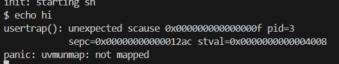
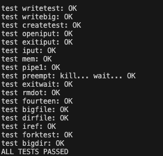

# Lab5:xv6 lazy page allocation

操作系统可以通过页表硬件实现的众多巧妙技巧之一是对用户空间堆内存的延迟分配（lazy allocation）。Xv6应用程序通过`sbrk()`系统调用向内核请求堆内存。在我们提供的内核中，`sbrk()`会分配物理内存并将其映射到进程的虚拟地址空间。对于大型请求，内核分配和映射内存可能需要很长时间。例如，1GB的内存由262,144个4096字节的页面组成；即使每个分配操作都很廉价，但如此大量的分配操作仍然非常耗时。此外，一些程序分配的内存比实际使用的要多（例如，用于实现稀疏数组），或者提前分配内存但并未立即使用。为了在这些情况下让`sbrk()`更快地完成，复杂的内核会采用延迟分配用户内存的方式。也就是说，`sbrk()`不会立即分配物理内存，而是只记住哪些用户地址被分配，并在用户页表中将这些地址标记为无效。当进程首次尝试使用任何延迟分配的内存页面时，CPU会生成一个页错误（page fault），内核通过分配物理内存、将其清零并映射来处理这个错误。在这个实验中，你将向xv6添加这种延迟分配功能。

> [!warning]
>在开始编写代码之前，请阅读xv6书籍的第4章（特别是4.6节），以及你可能需要修改的相关文件：
> kernel/trap.c   kernel/vm.c    kernel/sysproc.c

要开始实验，首先切换到 `lazy` 分支。按照以下步骤操作：
```bash
$ git fetch
$ git checkout lazy
$ make clean
```
##  Eliminate allocation from sbrk() ([easy](https://pdos.csail.mit.edu/6.S081/2020/labs/guidance.html))

> [!important]
>你的第一个任务是删除 `sbrk(n)` 系统调用实现中的内存分配代码。`sbrk(n)` 系统调用会将进程的内存大小增加 `n` 字节，并返回新分配区域的起始地址（即旧的大小）。修改后的 `sbrk(n)` 应该只增加进程的大小（`myproc()->sz`），并返回旧的大小，而不实际分配内存。因此，你需要删除对 `growproc()` 的调用（但仍然需要增加进程的大小！）。

尝试猜测修改的结果：什么会出问题？

进行此修改后，启动 xv6，并在 shell 中输入 `echo hi`。你应该会看到类似以下的内容：
```shell
init: starting sh
$ echo hi
usertrap(): unexpected scause 0x000000000000000f pid=3
            sepc=0x0000000000001258 stval=0x0000000000004008
va=0x0000000000004000 pte=0x0000000000000000
panic: uvmunmap: not mapped
```
“`usertrap(): ...`” 消息来自 `trap.c` 中的用户陷阱处理程序；它捕获到了一个不知道如何处理的异常。请确保你理解为什么会出现此页错误。“`stval=0x0..04008`” 表示导致页错误的虚拟地址是 `0x4008`。
### 实验步骤
修改`kernel/sysproc.c`中的`sys_sbrk(void)`fangfa
```c
uint64
sys_sbrk(void)
{
  int addr;
  int n;
  if(argint(0, &n) < 0)
    return -1;
  addr = myproc()->sz;
  //仅增加页面大小，但是不实际分配内存。
  myproc()->sz = myproc()->sz + n;
  // if(growproc(n) < 0)
  //   return -1;
  return addr;
=4462f4546ac1e555&utm_campaign=A203&utm_source=bisem&utm_medium=search&ytag=ucloud_4462f4546ac1e555_A203_bisem_search&msclkid=63adcb4a831f1d36fb0bac350e1fc9a9
}
```

##  Lazy allocation ([moderate](https://pdos.csail.mit.edu/6.S081/2020/labs/guidance.html))

> [!important]
> 修改`trap.c`中的代码，以应对来自用户空间因为将页面与一个错误的物理内存地址进行映射所引起的page fault。之后返回用户空间让进程继续执行。你应该将你的代码添加在 printf 调用产生  "usertrap(): ..." 信息之前。为保证`echo hi`命令能够工作，请修改你所需要的任何xv6内核中的代码。

一些提示：
 - 你可以通过检查 `r_scause()` 是否为 13 或 15 来判断一个故障是否是page fault，这通常发生在 `usertrap()` 中。
 - `r_stval()` 返回 RISC-V的`stval`寄存器，这个寄存器包含引起page fault 的虚拟地址。
 - 参考`vm.c`中`uvmalloc()`的代码，这部分代码在`sbrk()`中被称为 (via growproc())。你将会调用`kalloc()`和`mappages()`。
 - `uvmunmap()`会发生panic。修改它使其当发生一些页面没有被映射时不发生panic。
 - 如果你的内核崩溃了，请查看`kernel/kernel.asm`中的sepc
 - 使用你在pgtbl 实验中实现的`vmprint`方法，来打印页表内容。
 - 如果你看到 "incomplete type proc" 错误，先包含 "spinlock.h"，然后再包含 "proc.h"。
 如果一切顺利，你的lazy allocation 代码应该能让 `echo hi` 正常工作。你应该至少会遇到一次页面错误（因此触发lazy allocation），可能还会遇到两次。
###  实验代码
在`kernel/proc.c 中增加代码`
```c
// to check if the va is in the lazy allocate range
int is_lazy_alloc_va(uint64 va) {
  // if va larger than the sz, it's means a invalid va
  if(va >= myproc()->sz) {
    return 0; 
  } 
  return 1;
}

// to lazy allocate memory for the va
int lazy_alloc(uint64 va) {
  // to get the page aligned va
  va = PGROUNDDOWN(va);
  // to allocate memory for the va
  char *mem = kalloc();
  // if the memory is not enough, return -1
  if (mem == 0) {
    return -1;
  }
  //to initialize the memory
  memset(mem, 0, PGSIZE);
  // to map the memory to the va
  if (mappages(myproc()->pagetable, va, PGSIZE, (uint64)mem, PTE_R | PTE_W | PTE_X | PTE_U) < 0) {
    kfree(mem);
    return -1;
  }
  return 0;
}
```
修改文件`kernel/trap.c`
```c
  .......
  } else if((which_dev = devintr()) != 0){
    // ok
  //增加代码
  //====================start============================ 
} else if(r_scause() == 13 || r_scause() == 15){
    // load or store page fault
    uint64 va = r_stval();
    // check if the va in the lazy allocate range
    if(is_lazy_alloc_va(va)){
      if(lazy_alloc(va) < 0){
        printf("lazy_alloc failed !\n");
        p->killed = 1;
      }
    } else {
      printf("lazy alloc unexpected scause %p pid=%d\n", r_scause(), p->pid);
      printf("            sepc=%p stval=%p\n", r_sepc(), r_stval());
      p->killed = 1;
    }
  }
  //====================end============================ 
  } else {
  ......
```
 修改`kernel/vm.c`
 ```c
void
uvmunmap(pagetable_t pagetable, uint64 va, uint64 npages, int do_free)
{
  uint64 a;
  pte_t *pte;

  if((va % PGSIZE) != 0)
    panic("uvmunmap: not aligned");

  for(a = va; a < va + npages*PGSIZE; a += PGSIZE){
    if((pte = walk(pagetable, a, 0)) == 0){
      continue;
      // panic("uvmunmap: walk");
    }
      
    if((*pte & PTE_V) == 0){
      continue;
      //panic("uvmunmap: not mapped");
    }
    if(PTE_FLAGS(*pte) == PTE_V)
      panic("uvmunmap: not a leaf");
    if(do_free){
      uint64 pa = PTE2PA(*pte);
      kfree((void*)pa);
    }
    *pte = 0;
  }
}

 ```
## Lazytests and Usertests ([moderate](https://pdos.csail.mit.edu/6.S081/2020/labs/guidance.html))
我们已经提供了 `lazytests`，这是一个 x86 的 xv6 用户程序，用于测试可能会对你的懒惰内存分配器造成压力的特定情况。请修改你的内核代码，确保 `lazytests` 和 `usertests` 都能通过。

需要处理的事项包括：

1. 处理负的 `sbrk()` 参数。
2. 如果进程在虚拟内存地址上发生页面错误，而该地址高于通过 `sbrk()` 分配的任何地址，则终止该进程。
3. 正确处理 `fork()` 中的父子进程内存拷贝。
4. 处理进程将有效地址（通过 `sbrk()` 分配）传递给系统调用（如 `read` 或 `write`）的情况，但该地址的内存尚未分配。
5. 正确处理内存不足的情况：如果在页面错误处理程序中 `kalloc()` 失败，则终止当前进程。
6. 处理堆栈下方无效页面的页面错误。

如果你的内核代码能通过 `lazytests` 和 `usertests`，那么你的解决方案是可接受的，输出如下：
```bash
$  lazytests
lazytests starting
running test lazy alloc
test lazy alloc: OK
running test lazy unmap...
usertrap(): ...
test lazy unmap: OK
running test out of memory
usertrap(): ...
test out of memory: OK
ALL TESTS PASSED
$ usertests
...
ALL TESTS PASSED
$
```

### 实验步骤
修改`kernel/proc.c`的`is_lazy_alloc_va`方法
```c
// to check if the va is in the lazy allocate range
int is_lazy_alloc_va(uint64 va) {
  // if va larger than the sz, it's means a invalid va
  if(va >= myproc()->sz) {
    return 0; 
  } 
  //add code
  // if va is in the gard page, it needn't to be allocate memory
  // or it will cause a remap panic
  if(va < PGROUNDDOWN(myproc()->trapframe->sp) && va > PGROUNDDOWN(myproc()->trapframe->sp) - PGSIZE) {
    return 0;
  }
  return 1;
}
```
修改`kernel/vm.c`中的`walkaddr` 函数
```c
uint64
walkaddr(pagetable_t pagetable, uint64 va)
{
  pte_t *pte;
  uint64 pa;

  if(va >= MAXVA)
    return 0;

  pte = walk(pagetable, va, 0);

  if(pte == 0 || (*pte & PTE_V) == 0){
    if (is_lazy_alloc_va(va)) {
      if (lazy_alloc(va) < 0) {
        return 0;
      }
      return walkaddr(pagetable, va);
    }
    return 0;
  }
  // if(pte == 0)
  //       return 0;
  // if((*pte & PTE_V) == 0)
  //   return 0;
  if((*pte & PTE_U) == 0)
    return 0;
  pa = PTE2PA(*pte);
  return pa;
}
```

